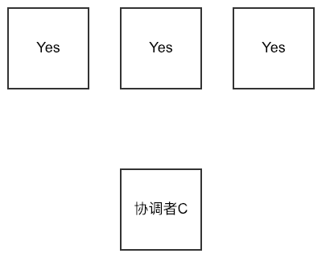

# 二阶段提交

二阶段提交协议用来保证分布式系统数据的一致性，即所有参与的进程要么都提交事务，要么都取消事务，实现`ACID`中的原子性。它引入了一个称为`协调者`的节点统一调度其它所有节点的事务执行逻辑，这些被调度的节点称为`参与者`。协议的流程分为提交事务请求和执行事务请求两个阶段。

## 阶段一：提交事务请求

第一阶段有以下几个步骤。

1. 协调者向参与者们发送事务内容，询问是否可以执行事务提交操作，然后等待参与者的响应。
2. 参与者们执行事务，但**不提交**。
3. 参与者们根据执行事务的结果反馈给协调者`Yes`或者`No`，分别表示可以执行事务和不可以执行事务。

这一阶段也称为投票阶段，即参与者们投票是否要执行接下来的事务提交操作。

## 阶段二：执行事务请求

如果第一阶段参与者们全票通过，也就是所有参与者都反馈了`Yes`，那么执行事务提交的步骤。

1. 协调者向参与者们发出Commit请求。
2. 参与者们提交事务。
3. 参与者们向协调者发送Ack消息。
4. 协调者收到Ack消息后完成事务。

如果第一阶段有一个参与者使用了一票否决权，即有一个参与者反馈了`No`或者超时无响应，那么执行中断事务的步骤。

1. 协调者向参与者们发出Rollback请求。
2. 参与者们回滚事务。
3. 参与者们向协调者发送Ack消息。
4. 协调者收到Ack消息后完成事务中断。

## 优缺点

二阶段协议的优点是实现简单，但是缺点有很多。

1. 协调者存在单点问题。如果在阶段二中协调者节点发生宕机，那么在阶段一中已经被参与者们锁定的资源就会一直处于锁定状态。
2. 数据不一致。在第二阶段中，如果协调者在发送了一部分Commit消息后就宕机，那么就会造成一部分节点提交了事务，而另一部分没有提交。
3. 同步阻塞问题。参与者在阶段一中需要等待其它参与者的响应。

## 缺陷

二阶段协议存在一个无法解决的问题，考虑以下场景。

假设有三个参与者并且所有的参与者在阶段一中都反馈了`Yes`。

在进入阶段二后，在协调者C向第一个参与者发出Commit请求后宕机了，而唯一接受到Commit请求的参与者也发生了宕机。

这时需要重新选举出一个新的协调者C'。但是新的协调者不知道第一个参与者之前事务的执行状态，可能是Commit，可能是Rollback，也可能还没有进行处理参与者就宕机了。由于第一个参与者事务状态的不确定性，新的协调者此时就无法让其余正常工作的节点执行Commit或Rollback，导致整个过程阻塞无法继续往下走，直到第一个参与者恢复。
