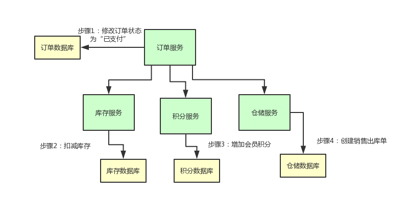

# TCC

TCC（Try-Confirm-Cancel）是一种分布式事务的实现方式，最早由支付宝提出。TCC和2PC很类似，Try-Confirm-Cancel对应2PC中的Prepare-Commit-Rollback，区别是2PC是资源层的（数据库），而TCC是应用层的，我们可以把TCC看成是应用层的2PC。、

一个TCC事务中有以下3个步骤。

- Try

尝试执行业务。完成所有业务检查并预留业务所需的资源，在这一步中不会直接执行业务逻辑。

- Confirm

确认执行业务逻辑。这一步会真正执行业务，并且不做任何业务检查，在业务执行过程中只会使用Try步骤中预留的资源。

- Cancel

取消执行业务逻辑。释放Try步骤中预留的资源。

## 业务场景

下面我们来看一个具体的场景。

## 参考

1. [《TCC事务的学习和理解》](https://blog.souche.com/tccshi-wu-de-xue-xi-he-li-jie/)
2. [《终于有人把“TCC分布式事务”实现原理讲明白了！》](http://developer.51cto.com/art/201811/587425.htm)
3. [《大规模SOA系统中的分布事务处事》](resources/try_confirm_cancel_1.pdf)
