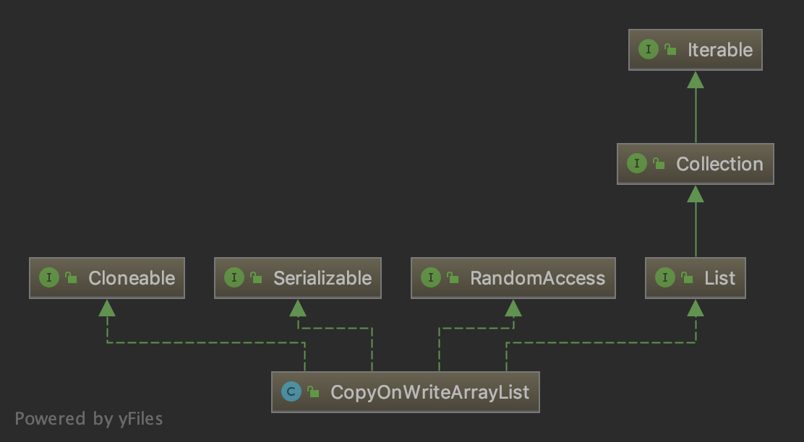

# CopyOnWriteArrayList




普通的`ArrayList`类是线程不安全的并且不支持并发读写，当我们用迭代器遍历一个`ArrayList`对象并同时对它进行修改时会抛出`ConcurrentModificationException`异常，`CopyOnWriteArrayList`对此进行了改进，同时它还是线程安全的。

`CopyOnWriteArrayList`的思想是当我们要往列表中新增或删除元素时，先把原来的列表复制一份，在复制出的新列表中进行元素的增加或删除操作，然后把列表的引用指向新列表。在写操作执行期间读操作会发生在原来的列表上，互不影响。多个并发的写操作则通过同步块让多个写操作串行化以达到线程安全的目的。

## add(E)

增加元素的过程如下。

1. 拷贝原数组。
2. 向新数组增加元素。
3. 修改数组引用，将其指向新的数组。

当有多个并发的写操作发生时通过`synchronized`串行化。

```java
public boolean add(E e) {
    synchronized (lock) {
        Object[] es = getArray();
        int len = es.length;
        es = Arrays.copyOf(es, len + 1);
        es[len] = e;
        setArray(es);
        return true;
    }
}

final void setArray(Object[] a) {
    array = a;
}
```

## get(int)

`get()`方法不需要加锁，意味着可以和写操作并发执行。

```java
public E get(int index) {
    return elementAt(getArray(), index);
}
```
