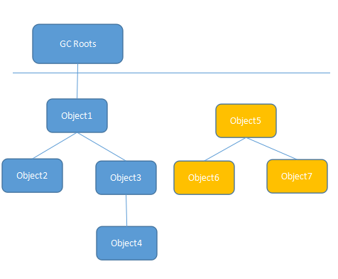
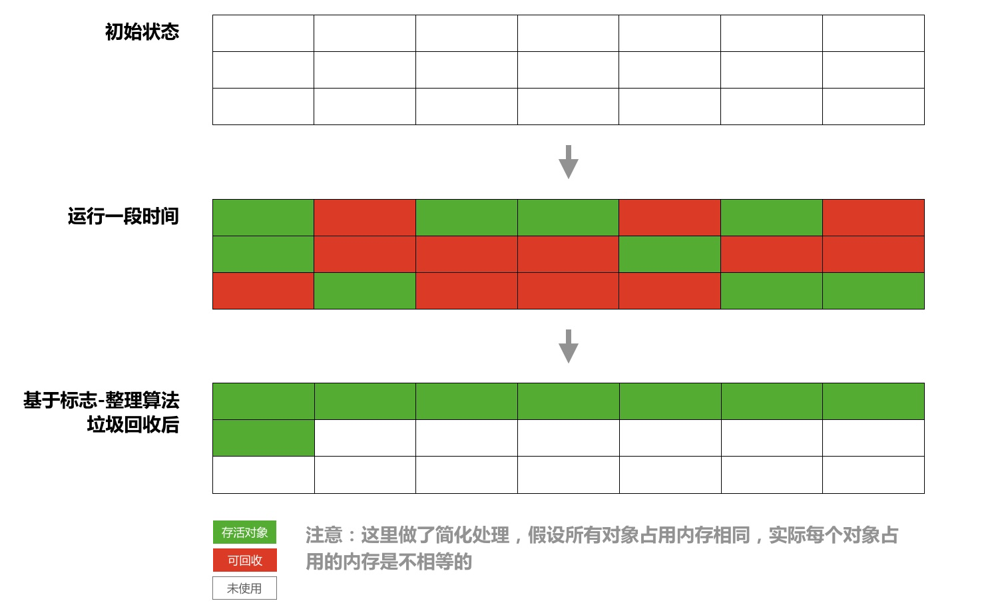

# 垃圾回收机制

## 可达性分析算法

Java中有一些对象称为`GC Roots`，如果一个`GC Roots`对象引用了某个对象，那么它们之间就存在一条引用链，当一个对象到任意一个`GC Roots`都没有引用链连接时，即表示该对象不可达，进入可回收状态。

下图中右侧部分的三个对象均不可能，因为没有与之关联的`GC Roots`。



以下几种类型的对象可以作为`GC Roots`。

1. 虚拟机栈中引用的对象。
2. 方法区中静态属性引用的对象。
3. 方法区中常量引用的对象。
4. 本地方法栈中JNI引用的对象。

## 对象的自救

一旦对象经过可达性分析后被判定为不可达，虚拟机不会立刻进行回收，对象还有机会进行自救。虚拟机会检查这部分对象是否有必要执行`finalize()`方法，如果对象没有覆盖`finalize()`方法或者该方法已经被调用过了，那么虚拟机就认为没必要再执行，这种情况下对象会被放入待回收集合，无法自救；否则，虚拟机会把符合条件的对象放到`F-Queue`队列中并用一个专门的线程去执行这些对象的`finalize()`方法，之后虚拟机会再次对队列中的对象进行可达性分析，如果依然判定为不可达，那么就放入待回收集合。由于每个对象的`finalize()`方法只会被虚拟机调用一次，因此对象只有1次自救的机会。


对象自救的方法就是在`finalize()`方法中重新与某个`GC Roots`对象进行关联，下面是一个例子。

```java
public class Test {

    static Test HOOK = null;

    @Override
    protected void finalize() throws Throwable {
        super.finalize();
        HOOK = this;
        System.out.println("finalize()");
    }

    public static void main(String[] args) throws InterruptedException {
        HOOK = new Test();
        HOOK = null;
        System.gc();

        // 等待对象自救。
        while (HOOK == null) {
            Thread.sleep(500);
        }
        // 自救成功，打印“save”。
        System.out.println("save");

        HOOK = null;
        System.gc();
        Thread.sleep(1000);
        if (HOOK == null) {
            // 自救失败。
            System.out.println("can not save");
        } else {
            System.out.println("save");
        }
    }
}

// 输出：
// finalize()
// save
// can not save
```

通过以上输出可以看到，`finalize()`方法只被调用了一次，因此第一次对象自救成功，第二次自救失败。

## 垃圾收集算法

### 标记-清除

标记-清除算法分为标记和清除两个阶段。首先把所有待回收的对象进行标记，然后再对标记的对象的内存进行清除。缺点是回收后的内存空间可能不是连续的（内存碎片），当需要存储内存上连续的大对象时（比如一个容量较大的数组对象），可能需要再触发一次GC。


### 复制

复制算法是把内存空间等分为2个大小一样的区域，每次只用1个区域存储对象，如果当前区域的内存用完了就把存活的对象复制到另一个区域内，然后把当前区域清空，它不存在标记-清除算法中会留下内存碎片的问题，其缺点是可用的内存是原来的一半。


### 标记-整理

标记-整理算法分为标记、整理和清除三个阶段。首先把所有待回收的对象进行标记，然后将存活对象都朝一端移动（即整理），最后直接清除掉整理完的边界以外的内存。



### 算法的选择


## 垃圾收集器

### Serial

### ParNew

### Parallel Scavenge

### Serial Old

### Parallel Old

### CMS

### G1


## 参考

1. [《GC算法与种类》](https://www.cnblogs.com/qdhxhz/p/9211095.html)
