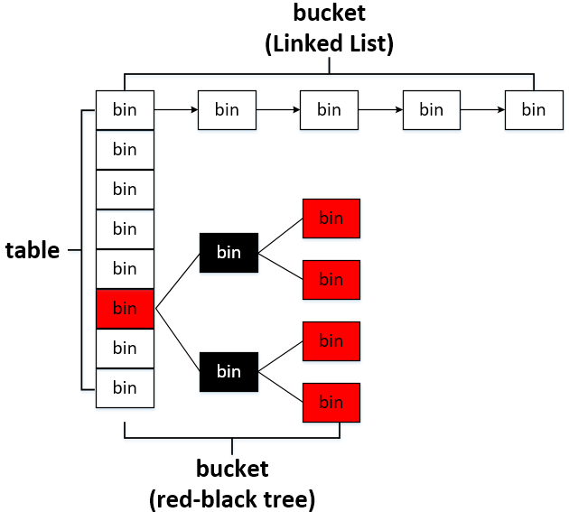

# HashMap


`HashMap`是一种常用的存储键值对数据结构，它实现了`Map`接口，可以O(1)时间内找到键对应的值，其层次结构如下。


在JDK1.8之前它的底层实现是“数组+链表”的形式，从JDK1.8开始变成“数组+链表+红黑树”的形式，当一个链表中节点个数大于8时，该链表会转为红黑树。



下面我们从构造函数看起。

## HashMap()

默认的无参构造器仅仅设置了字段`loadFactor`的值，该字段表示负载因子，默认负载因子是`0.75`，我们先把它放在一边，之后会用到。

```java
static final float DEFAULT_LOAD_FACTOR = 0.75f;

public HashMap() {
    this.loadFactor = DEFAULT_LOAD_FACTOR;
}
```

## HashMap(int)

该构造方法可以设置底层数组的初始容量，在它的内部调用了另一个构造方法。

```java
public HashMap(int initialCapacity) {
    this(initialCapacity, DEFAULT_LOAD_FACTOR);
}

public HashMap(int initialCapacity, float loadFactor) {
    // 检查初始容量和负载因子的合法性。
    if (initialCapacity < 0)
        throw new IllegalArgumentException("Illegal initial capacity: " +
                                            initialCapacity);
    if (initialCapacity > MAXIMUM_CAPACITY)
        initialCapacity = MAXIMUM_CAPACITY;
    if (loadFactor <= 0 || Float.isNaN(loadFactor))
        throw new IllegalArgumentException("Illegal load factor: " +
                                            loadFactor);
    this.loadFactor = loadFactor;
    // threshold表示当元素数量达到多少后需要对底层数组重新调整大小。
    this.threshold = tableSizeFor(initialCapacity);
}

// 返回大于等于cap的最小的2的幂数。
// 当 cap = 2 时，方法返回值为2，因为 2 ^ 1 = 2。
// 当 cap = 31 时，方法返回值是32，因为 2 ^ 4 = 16 < 31 而 2 ^ 5 = 32 > 31。
static final int tableSizeFor(int cap) {
    int n = cap - 1;
    n |= n >>> 1;
    n |= n >>> 2;
    n |= n >>> 4;
    n |= n >>> 8;
    n |= n >>> 16;
    return (n < 0) ? 1 : (n >= MAXIMUM_CAPACITY) ? MAXIMUM_CAPACITY : n + 1;
}
```

## put(K, V)

该方法把键值对放入map中，内部调用`putVal()`方法。

```java
public V put(K key, V value) {
    return putVal(hash(key), key, value, false, true);
}
```

这里有一个非常重要的方法：`hash()`，利用它可以计算出键值对的哈希值。该方法内部主要调用了定义在`java.lang.Object`类中的`hashCode()`方法来获得对象的哈希值。

```java
static final int hash(Object key) {
    int h;
    return (key == null) ? 0 : (h = key.hashCode()) ^ (h >>> 16);
}
```

接下来我们看下`putVal()`方法。

```java
final V putVal(int hash, K key, V value, boolean onlyIfAbsent,
               boolean evict) {
    Node<K,V>[] tab; Node<K,V> p; int n, i;
    // table就是我们最开始介绍的“数组+链表+红黑树”中的数组部分。
    // table的类型是transient Node<K,V>[] table;
    // 当table未初始化时（null），或其容量为0时调用resize()方法进行初始化/扩容。
    if ((tab = table) == null || (n = tab.length) == 0)
        n = (tab = resize()).length;

    // (n - 1) & hash 在这里等价于 hash % n，这个等价关系成立的条件是n是2的幂次，在HashMap的各个函数中都遵循这个要求，因此可以满足。
    // 这里用位运算的原因是，相比取模运算，位运算的效率更高。
    // 如果tab[i = (n - 1) & hash] == null表示数组的这一格是空的，还没有元素，那么就创建新的键值对节点。
    if ((p = tab[i = (n - 1) & hash]) == null)
        tab[i] = newNode(hash, key, value, null);
    else {
        Node<K,V> e; K k;
        if (p.hash == hash &&
            ((k = p.key) == key || (key != null && key.equals(k))))
            e = p;
        else if (p instanceof TreeNode)
            e = ((TreeNode<K,V>)p).putTreeVal(this, tab, hash, key, value);
        else {
            for (int binCount = 0; ; ++binCount) {
                if ((e = p.next) == null) {
                    p.next = newNode(hash, key, value, null);
                    if (binCount >= TREEIFY_THRESHOLD - 1) // -1 for 1st
                        treeifyBin(tab, hash);
                    break;
                }
                if (e.hash == hash &&
                    ((k = e.key) == key || (key != null && key.equals(k))))
                    break;
                p = e;
            }
        }
        if (e != null) {
            V oldValue = e.value;
            if (!onlyIfAbsent || oldValue == null)
                e.value = value;
            afterNodeAccess(e);
            return oldValue;
        }
    }
    ++modCount;
    if (++size > threshold)
        resize();
    afterNodeInsertion(evict);
    return null;
}
```

键值对节点对应的数据结构如下。

```java
// java.util.HashMap.Node
// 此处省略了构造方法和其它的方法。
static class Node<K,V> implements Map.Entry<K,V> {
    final int hash;
    final K key;
    V value;
    Node<K,V> next;
}
```

## resize()

## get(Object)

## getOrDefault(Object, V)

```java
public V getOrDefault(Object key, V defaultValue) {
    Node<K,V> e;
    return (e = getNode(hash(key), key)) == null ? defaultValue : e.value;
}
```

## remove(Object)

## size()

返回键值对的数量。

```java
public int size() {
    return size;
}
```

## 线程安全问题

`HashMap`是线程不安全的。

## 参考

1. [《JDK1.8--HashMap》](https://www.jianshu.com/p/3287cd3cec4b)
