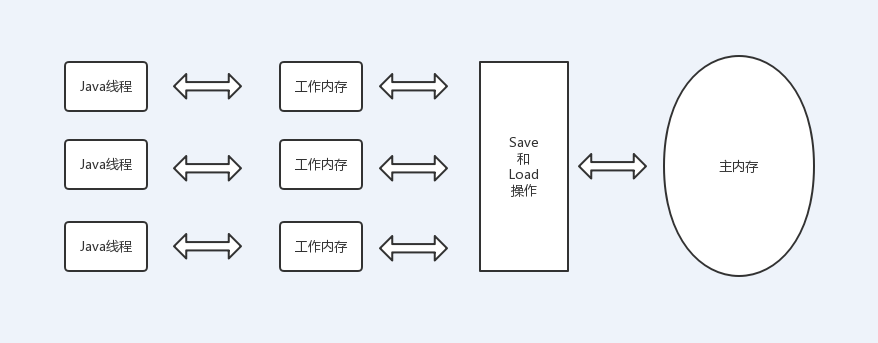
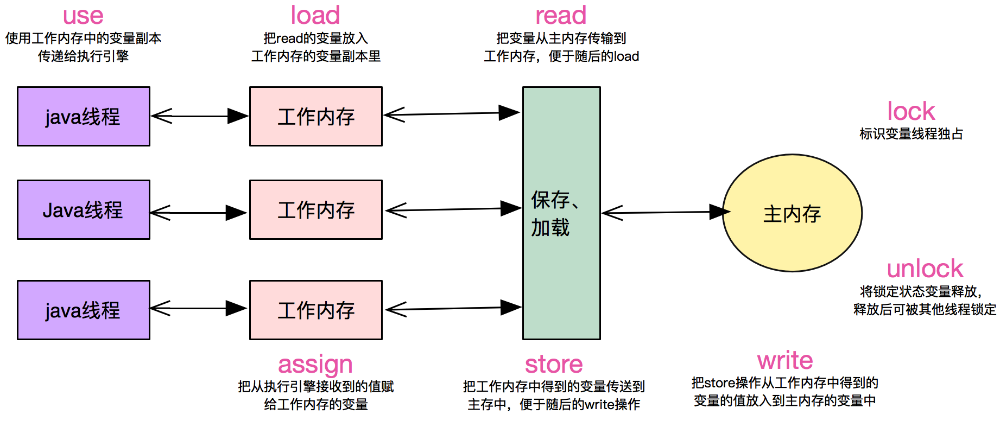

# 内存模型

## 硬件内存模型

现代的CPU通常拥有多个核心，每个核心都有自己的高速缓存（常见的有L1、L2、L3缓存），CPU在处理数据时会先把内存中的数据复制到缓存中，然后从缓存复制到CPU寄存器中，处理完成后再把CPU寄存器中的数据写回缓存，最后再把数据写回到内存中。

由于每个核心的缓存互相独立，因此带来了数据一致性的问题，不同核心的缓存对同一块内存区域的缓存数据可能不一致，比如内存中有变量`a`，它的值是1，CPU的2个核心都缓存了这个变量，记为`a'`，这时其中一个核心把`a'`的值更新为2，那么这个时候两个核心的缓存数据就不一致了，当要把变量的值写回内存是产生了冲突，不知道以哪个核心的缓存为准。

为了解决缓存一致性的问题，处理器的缓存会遵循一些协议，比如有MSI、MESI、MOSI等，在对缓存或内存进行读写操作时，CPU会遵循特定的协议进行操作，不同的CPU也会存在操作上的差异。

## Java内存模型

Java提供了自己的内存模型（Java Memory Model，简称JMM）来屏蔽不同平台上内存访问的差异，使得同样的程序在不同平台上有同样的内存访问效果。

在Java内存模型中，内存分为工作内存和主内存。每个线程有自己的工作内存，保存了线程用到的变量在主内存中的副本。线程对变量的读写操作只能作用于该变量在工作内存的副本上，而不能直接读写主内存中该变量的本体，线程之间也不能互相访问各自的工作内存。

Java内存模型看似和硬件内存模型非常类似，但是这两者其实并没有直接的关系，线程的工作内存可以在CPU寄存器中，也可以在缓存或内存中，主内存也是同理。

## 内存间的交互

Java内存模型定义了8种操作来实现如何把变量从主内存读到工作内存中以及如何把工作内存中的数据写回主内存中，这些操作都是原子的。

1. lock：锁定主内存中的变量，把它标识为被一个线程独占的状态。
2. unlock：释放一个在主内存中处于锁定状态的变量。
3. read：把一个变量的值从主内存传输到线程的工作内存中。
4. load：把`read`操作得到的值放入工作内存的变量副本中。
5. use：把工作内存中一个变量的值传递给执行引擎。
6. assign：把执行引擎返回的值赋给一个工作内存的变量。
7. store：把工作内存中一个变量的值传送到主内存。
8. write：把`store`操作得到的值放入主内存的变量中。

需要注意的是，虽然每一个操作都是原子的，但是操作之间并不是原子的。

### 对于long和double的特殊规则

针对没有被`volatile`修饰的64位`long`和`double`类型的变量，JMM规定`load`、`store`、`read`、`write`这4种操作可以分为2次32位的操作来执行，当多个线程同时对这些变量进行修改是读取时，就有可能读到被其它线程修改了一半的值。
虽然JMM对64位数据类型的操作没有强制要求满足原子性，但还是推荐各个虚拟机实现这么做。目前在商用虚拟机中都把64位数据的操作实现为原子操作，因此实际上在开发时并不需要把64位类型的变量声明为volatile。

## Java内存模型的特征

### 原子性

原子性是指一个操作是不可中断的，执行过程中不会被其它线程所影响。JMM使用了上面提到的几种操作保证了对基本类型操作的原子性。而对于更复杂的情况，比如多个多条语句的原子性操作就需要用到`synchronized`关键字。

### 可见性

可见性是指一个线程修改了共享变量的值，其它的线程能立刻得知被修改后的最新值。除了`volatile`外，`synchronized`和`final`也可以实现可见性。

### 有序性

CPU最后执行指令的顺序未必和我们写的代码顺序一一对应，很有可能在执行时是乱序的，这是因为编译器、处理器和内存系统为了提高性能会对指令进行重排序。

- 编译器重排序

- 指令重排序

- 内存系统重排序

## Happens-Before

除了使用`volatile`、`synchronized`之外，JMM还设立了一个称为`Happens-Before`（先行发生）的原则来保证有序性。先行发生是指如果操作A先行发生于B，那么在操作B发生之前，操作A的产生的影响可以被操作B观察到，包括共享变量值的修改、调用了方法等。先行发生原则有以下几个规则。

1. 程序次序规则：在一个线程内按照代码顺序，写在前面的操作先行发生于后面的操作。
2. 管程锁定规则：一个`unlock`操作先行发生于后面对同一个锁的lock操作。
3. volatile变量规则：对一个`volatile`变量的写操作先行发生于对它的读操作。
4. 线程启动规则：一个线程的`start()`方法调用先行发生于此线程的每一个动作。
5. 线程终止规则：一个线程中的所有操作都先行发生于此线程的终止检测，比如用`Thread.isAlive()`检测线程是否已终止。
6. 线程中断规则：一个线程的`interrupt()`方法调用先行发生于被中断线程的代码检测到中断事件的发生。
7. 对象终结规则：一个对象的构造方法调用结束先行发生于它的`finalize()`方法的开始。
8. 传递性：如果操作A现行发生于操作B，操作B现行发生于操作C，那么操作A现行发生于操作C。

## 参考

1. [《全面理解Java内存模型(JMM)及volatile关键字》](https://blog.csdn.net/javazejian/article/details/72772461)
2. [《从源代码到Runtime发生的重排序编译器重排序指令重排序内存系统重排序阻止重排序》](https://cloud.tencent.com/developer/article/1036747)
