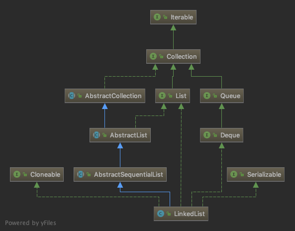

# LinkedList

`LinkedList`是一个底层使用双向链表实现的列表，它实现了`List`和`Deque`接口说明它既可以作为一个列表使用，又可以作为双端队列使用。`List`和`Deque`的区别是前者可以通过索引定位到元素，后者可以同时在集合首尾增加或删除元素，从而实现先进先出的队列或是后进先出的栈。它没有实现`RandomAccess`接口，因此不支持随机访问，只支持顺序访问，这是它和`ArrayList`最大的区别。



下面我们从构造方法看起，源码出自JDK10。

## LinkedList()

这其实是一个空方法，没有做任何事情。

```java
public LinkedList() {
}
```

## add(E)

往列表中添加一个元素。

```java
public boolean add(E e) {
    linkLast(e);
    return true;
}

void linkLast(E e) {
    final Node<E> l = last;
    final Node<E> newNode = new Node<>(l, e, null);
    last = newNode;
    if (l == null)
        first = newNode;
    else
        l.next = newNode;
    size++;
    modCount++;
}

// Node是LinkedList中的内部类。
private static class Node<E> {
    E item;
    Node<E> next;
    Node<E> prev;

    Node(Node<E> prev, E element, Node<E> next) {
        this.item = element;
        this.next = next;
        this.prev = prev;
    }
}
```
