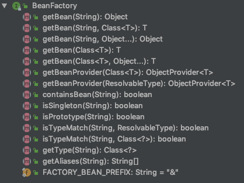

# IOC

IOC是Inversion of Control的缩写，意思是控制反转。通常创建对象都是通过`new`关键字主动创建的，而在Spring中由IOC容器负责对象的创建和销毁，因此称为控制反转。

Spring在启动时会根据不同的渠道注册Bean到IOC容器中，最常见的是通过读取XML文件以及扫描注解的方式注册Bean。对于web应用，Spring Boot在启动时默认会构造一个`AnnotationConfigServletWebServerApplicationContext`类型对象用来存储应用上下文，我们可以通过它获得注册在IOC容器中的对象。


该类的结构非常复杂，我们需要知道的重点是`AnnotationConfigServletWebServerApplicationContext`类实现了`BeanFactory`接口。从名字上就可以看出`BeanFactory`接口是一个Bean的工厂，可以通过它来获得Bean。



在`AnnotationConfigServletWebServerApplicationContext`类的构造方法中会创建两个对象。`AnnotatedBeanDefinitionReader`会注册6种注解处理器到应用上下文，分别用于处理`@Configuration`、`@Autowired`、`@Value`、`@PostConstruct`、`@PreDestroy`、`@EventListener`等注解。`ClassPathBeanDefinitionScanner`则用于扫描某个包下所有被`@Component`注解标记的Bean，包括被`@Repository`、`@Service`、`@Controller`注解标记的Bean，因为这些注解本身都被`@Component`注解所标记。

```java
public AnnotationConfigServletWebServerApplicationContext() {
    this.reader = new AnnotatedBeanDefinitionReader(this);
    this.scanner = new ClassPathBeanDefinitionScanner(this);
}
```

`AnnotatedBeanDefinitionReader`和`ClassPathBeanDefinitionScanner`最终会解析出Bean的配置信息，并封装成`BeanDefinition`对象注册到应用上下文中，最后通过反射创建对象，实现IOC。

## 循环依赖

当两个Bean互相依赖并使用构造方法注入时，就会发生循环依赖的问题。

```java
@Service
public class ServiceA {

    public ServiceA(ServiceB serviceB) {
    }
}

@Service
public class ServiceB {

    public ServiceB(ServiceA serviceA) {
    }
}
```

有以下几种方法可以解决循环依赖的问题。

1. 把其中一个Bean设置为懒加载。

```java
@Service
public class ServiceA {

    public ServiceA(@Lazy ServiceB serviceB) {
    }
}

@Service
public class ServiceB {

    public ServiceB(ServiceA serviceA) {
    }
}
```

2. 使用Setter注入而不用构造方法注入。

```java
@Service
public class ServiceA {

    private ServiceB serviceB;

    @Autowired
    public void setServiceB(ServiceB serviceB) {
        this.serviceB = serviceB;
    }
}

@Service
public class ServiceB {

    public ServiceB(ServiceA serviceA) {
    }
}
```

3. 字段注入。

```java
@Service
public class ServiceA {

    @Autowired
    private ServiceB serviceB;
}

@Service
public class ServiceB {

    @Autowired
    private ServiceA serviceA;
}
```

## 参考

1. [《Spring IOC 容器源码分析》](https://javadoop.com/post/spring-ioc)
