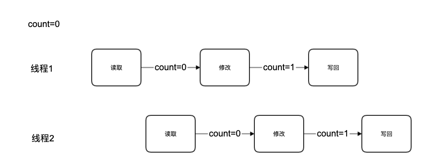

# synchronized、volatile 和 lock

## 原子性

原子性是指在几个操作成为一个不可分割的整体，在调用过程中不可中断也不会被其它线程干扰，就像是执行一个命令一样。
下面的代码由于它不是一个原子操作，而是读取->自增->写回的复合操作，当有多个线程同时执行这三个操作时顺序就可能发生交错，从而导致结果与预期不符。

```java
count++;  
```



## 可见性

可见性是指一个线程对一个共享变量的修改可以被其它线程立刻看到。

在下面的代码中`running`就是一个共享变量，线程A和线程B都拥有它，线程B通过改变`running`的值从而让线程A退出死循环，但实际上这里存在着隐患。

```java
// 线程A
public void run() {
    while (running) {
        System.out.println("running");
    }
}

// 线程B
public void shutdown() {
    running = false;
}
```

隐患要从Java的内存模型说起。如下图所示，Java内存分为主内存和工作内存，所有变量都存储在主内存中，每个线程有各自独立的工作内存，工作内存里保存着它用到的主内存中变量的副本。也就是说线程不直接操作主内存中的变量，而是操作该变量在工作内存里的一份拷贝，并且有多少个线程用到这个变量就有多少个拷贝，因此上述代码中的线程A和线程B都持有`running`变量的一个副本，当线程B修改它持有的`running`变量副本的时候并不能保证线程A能看到。


为了能让线程A及时看到线程B对`running`变量的修改，必须要做两件事：

1. 线程B把修改后的值写入主内存。
2. 线程A从主内存中读取最新的值。

## 有序性

有序性是指程序执行顺序按代码的顺序执行。

## 可重入锁

可重入指的是同一把锁可以被同一个线程多次获取。通常的实现是锁的内部有一个计数器，当一个线程获取锁时计数器就加1同时记录锁的拥有者，解锁时减1，计数器减为0时锁就被释放。

> [示例：可重入锁](https://github.com/pojozhang/playground/blob/master/solutions/java/src/main/java/playground/interview/MyReentrantLock.java)

重入的一个好处是简化了并发代码的开发，下面看一个例子：
某个对象有`a()`，`b()`两个方法，它们都被`synchronized`修饰，因此在执行前都会先去获取该对象上的锁，如果锁是不可重入的，那么当`a()`方法中调用`b()`时发现锁已经被获取了，因此造成了死锁，而可重入锁避免了这个问题。

```java
private synchronized void a() {
    System.out.println("method A");
    b();
}

private synchronized void b() {
    System.out.println("method B");
}
```

相反的，一把锁只能被线程获取一次，那么它就是不可重入锁。

> [示例：不可重入锁](https://github.com/pojozhang/playground/blob/master/solutions/java/src/main/java/playground/interview/NonReentrantLock.java)

## synchronized <a id="synchronized"></a>

`synchronized`修饰符有三个作用：

1. 保证原子性
2. 保证可见性
3. 保证有序性

我们先看一段代码：

```java
public void test() {
    synchronized (this) {
        System.out.println("test");
    }
}
```

上述代码中，当有多个线程执行到`synchronized`这一句时，同一时刻只有一个线程能进入下面的代码块中，其余线程会一直阻塞直到之前的线程退出了代码块。

下面是对这段代码进行编译后再用`javap`工具打印出的字节码：

```java
public void test();
    Code:
       0: aload_0
       1: dup
       2: astore_1
       3: monitorenter
       4: getstatic     #2                  // Field java/lang/System.out:Ljava/io/PrintStream;
       7: ldc           #3                  // String test
       9: invokevirtual #4                  // Method java/io/PrintStream.println:(Ljava/lang/String;)V
      12: aload_1
      13: monitorexit
      14: goto          22
      17: astore_2
      18: aload_1
      19: monitorexit
      20: aload_2
      21: athrow
      22: return
```

我们可以看到`synchronized`代码块的首位加上了`monitorenter`和`monitorexit`指令。

在JVM中每个对象都有一个与之对应的`monitor`，当`monitor`被占用时对象就被上锁，并且这个`monitor`也有一个计数器，可以被同一个线程多次获取，因此我们可以看到它就是一个可重入锁。当JVM执行`monitorenter`指令时就会去尝试获取这把锁，当执行`monitorexit`指令时就把锁的计数器减去1，如果减为0，那么就释放。

现在我们看一下当JVM执行`monitorenter`指令时具体做了什么，你可以在[这里](https://github.com/unofficial-openjdk/openjdk/blob/jdk8u/jdk8u/hotspot/src/share/vm/interpreter/interpreterRuntime.cpp)找到源码。

```cpp
IRT_ENTRY_NO_ASYNC(void, InterpreterRuntime::monitorenter(JavaThread* thread, BasicObjectLock* elem))
#ifdef ASSERT
  thread->last_frame().interpreter_frame_verify_monitor(elem);
#endif
  if (PrintBiasedLockingStatistics) {
    Atomic::inc(BiasedLocking::slow_path_entry_count_addr());
  }
  Handle h_obj(thread, elem->obj());
  assert(Universe::heap()->is_in_reserved_or_null(h_obj()),
         "must be NULL or an object");
  if (UseBiasedLocking) {
    // Retry fast entry if bias is revoked to avoid unnecessary inflation
    ObjectSynchronizer::fast_enter(h_obj, elem->lock(), true, CHECK);
  } else {
    ObjectSynchronizer::slow_enter(h_obj, elem->lock(), CHECK);
  }
  assert(Universe::heap()->is_in_reserved_or_null(elem->obj()),
         "must be NULL or an object");
#ifdef ASSERT
  thread->last_frame().interpreter_frame_verify_monitor(elem);
#endif
IRT_END
```

你可以在[这里](https://github.com/unofficial-openjdk/openjdk/blob/jdk8u/jdk8u/hotspot/src/share/vm/runtime/synchronizer.cpp)找到源码。

```cpp
void ObjectSynchronizer::fast_enter(Handle obj, BasicLock* lock, bool attempt_rebias, TRAPS) {
 if (UseBiasedLocking) {
    if (!SafepointSynchronize::is_at_safepoint()) {
      BiasedLocking::Condition cond = BiasedLocking::revoke_and_rebias(obj, attempt_rebias, THREAD);
      if (cond == BiasedLocking::BIAS_REVOKED_AND_REBIASED) {
        return;
      }
    } else {
      assert(!attempt_rebias, "can not rebias toward VM thread");
      BiasedLocking::revoke_at_safepoint(obj);
    }
    assert(!obj->mark()->has_bias_pattern(), "biases should be revoked by now");
 }

 slow_enter (obj, lock, THREAD) ;
}
```


在HotSpot虚拟机中，`monitor`的实现是`ObjectMonitor`，可以在[这里](https://github.com/unofficial-openjdk/openjdk/blob/jdk8u/jdk8u/hotspot/src/share/vm/runtime/objectMonitor.hpp)看到源码，其数据结构如下：

```cpp
ObjectMonitor() {
    _header       = NULL;
    _count        = 0;
    _waiters      = 0,
    _recursions   = 0;
    _object       = NULL;
    _owner        = NULL;
    _WaitSet      = NULL;
    _WaitSetLock  = 0 ;
    _Responsible  = NULL ;
    _succ         = NULL ;
    _cxq          = NULL ;
    FreeNext      = NULL ;
    _EntryList    = NULL ;
    _SpinFreq     = 0 ;
    _SpinClock    = 0 ;
    OwnerIsThread = 0 ;
    _previous_owner_tid = 0;
  }
```

几个重要的属性：

- `_owner`指向持有`ObjectMonitor`对象的线程。
- ``

## volatile <a id="volatile"></a>

`volatile`修饰符有以下3个作用：

- 保证可见性

- 保证有序性

在[Java内存模型](jmm.md#ordering)中我们提到代码的执行顺序可能因为编译器和CPU进行指令重排序导致其和编写时的顺序不一致，从而在多线程环境下产生一些问题。
`volatile`可以起到禁止指令重排序的作用

- 保证64位变量的原子性

可以保证对`long`和`double`类型变量的读写操作是原子的

## lock

锁的状态总共有四种：无锁状态、偏向锁、轻量级锁和重量级锁。

### 偏向锁
偏向锁是JDK1.6之后引入的。
