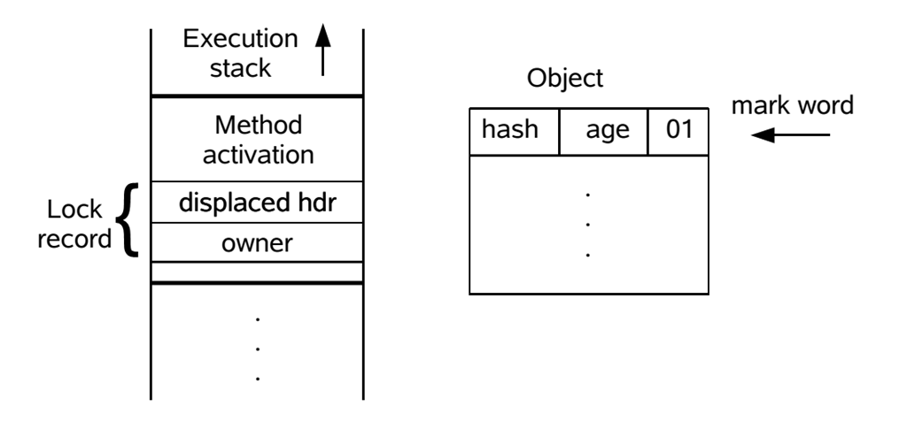
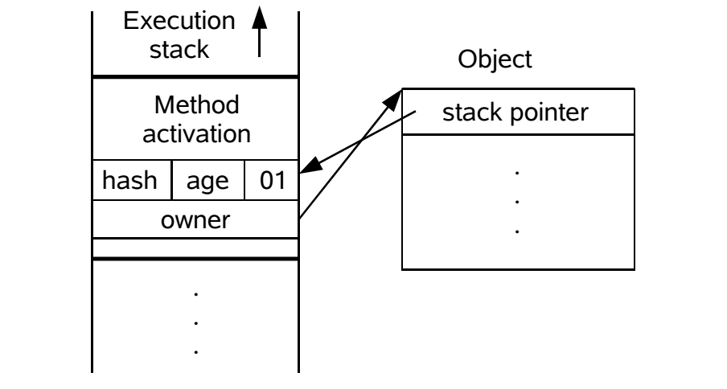

# synchronized

在Java中我们经常使用`synchronized`关键字实现线程安全，在深入理解它的作用和原理之前，我们先要了解并发编程中的几个概念。

## 概念

### 线程同步

线程同步是指多个线程并发访问共享数据时，保证任意时刻该数据只能被一个线程进行访问，通常可以用互斥锁、信号量等方式实现同步。`synchronized`关键字就是用互斥的方法实现线程同步，互斥是指任意时刻只有一个线程可以执行某段代码。

### 可重入锁

可重入指的是同一把锁可以被同一个线程多次获取。通常的实现是锁的内部有一个计数器，当一个线程获取锁时计数器就加1同时记录锁的拥有者，解锁时减1，计数器减为0时锁就被释放。

> [示例：可重入锁](https://github.com/pojozhang/playground/blob/master/solutions/java/src/main/java/playground/interview/MyReentrantLock.java)

重入的一个好处是简化了并发代码的开发，下面看一个例子：
某个对象有`a()`，`b()`两个方法，它们都被`synchronized`修饰，因此在执行前都会先去获取该对象上的锁，如果锁是不可重入的，那么当`a()`方法中调用`b()`时发现锁已经被获取了，因此造成了死锁，而可重入锁避免了这个问题。

```java
private synchronized void a() {
    System.out.println("method A");
    b();
}

private synchronized void b() {
    System.out.println("method B");
}
```

相反的，一把锁只能被线程获取一次，那么它就是不可重入锁。

> [示例：不可重入锁](https://github.com/pojozhang/playground/blob/master/solutions/java/src/main/java/playground/interview/NonReentrantLock.java)

### 公平锁

公平锁是指当多个线程等待一把锁时，按照申请锁的先后顺序依次获得锁，先申请的优先线程当锁被释放时可以优先获得这把锁；非公平锁则相反，当锁被释放时任何一个等待锁的线程都有机会获得锁。`synchronized`是非公平的。

## 原理

我们先看一段代码：

```java
public void test() {
    synchronized (this) {
        System.out.println("test");
    }
}
```

上述代码中，当有多个线程执行到`synchronized`这一句时，同一时刻只有一个线程能进入下面的代码块中，其余线程会一直阻塞直到之前的线程退出同步块。

下面是对这段代码进行编译后再用`javap`工具打印出的字节码。

```java
public void test();
    Code:
       0: aload_0
       1: dup
       2: astore_1
       3: monitorenter
       4: getstatic     #2                  // Field java/lang/System.out:Ljava/io/PrintStream;
       7: ldc           #3                  // String test
       9: invokevirtual #4                  // Method java/io/PrintStream.println:(Ljava/lang/String;)V
      12: aload_1
      13: monitorexit
      14: goto          22
      17: astore_2
      18: aload_1
      19: monitorexit
      20: aload_2
      21: athrow
      22: return
```

我们可以看到`synchronized`代码块的首尾加上了`monitorenter`和`monitorexit`指令。

在JVM中每个对象都有一个与之对应的`monitor`，当对象的`monitor`被占用时就表示对象已经就其它线程占用，每个`monitor`拥有一个计数器，如果被同一个线程多次获取，那么就把计数器加上1，如果被线程释放，那么就把计数器减去1，相当于是一把可重入锁。当JVM执行`monitorenter`指令时就会去尝试获取这把锁，当执行`monitorexit`指令时就把锁的计数器减去1，如果减为0，那么就释放。

上面我们说只有对象才有对应的`monitor`，而基本类型不属于对象，因此以下代码是**不能**通过编译的。

```java
public void test() {
    int n = 0;
    synchronized (n) {
        System.out.println("test");
    }
}
```

### 锁的优化

当多个线程同时到达`synchronized`块时，只有一个线程可以获得`monitor`对象，其余线程会被阻塞，由于Java的线程是直接映射到操作系统的原生线程上的，因此阻塞或唤醒一个线程需要从用户态切到内核态，由操作系统帮助完成。用户态和内核态之间的转换需要临时保存当前系统的一些状态，比如CPU寄存器的值，堆栈信息等，以便未来当线程被唤醒后可以继续执行，这一过程需要耗费较多的CPU时间，我们把这一方式称为**重量级锁**。

JVM对此进行了优化，不会直接使用重量级锁，而是采取多种优化机制，下面一一介绍。

#### 自旋锁

通常共享数据被一个线程锁定后，它的锁定状态只会持续较短的时候然后就会被释放。针对这种情况JVM引入了自旋锁的概念，自旋是指循环，自旋锁就是指通过循环的方式获得锁，伪代码如下。

```java
for(; ; ){
  // 尝试获取锁。
}
```

在实际中，自旋通常不是死循环，而是有一个循环次数的阈值，如果循环的次数超过了阈值依然没有获取锁，那么就按照重量级锁的步骤阻塞线程。在JDK1.6之后该阈值是JVM根据系统的运行状态动态设定的，如果上一次自旋成功获得了锁，那么JVM会认为本次自旋可以获得锁的概率较大，阈值也会相应提高；相反，如果以往对于某个锁通过自旋的方式很少能够成功获得，那么之后就可能直接跳过自旋的过程，避免浪费CPU时间。

自旋锁有以下几个缺点。

1. 如果一个锁被占用的时间较长，那么其它线程的自旋浪费了CPU时间。
2. 如果有大量的线程试图获得一把锁，那么就会有大量的线程进行自旋，比较消耗CPU资源。

#### 轻量级锁

在某些情况下锁竞争并不存在，如果每次进入同步块前都申请重量级锁而在实际运行中又没有线程竞争那么就比较浪费，因此JVM引入了轻量级锁的概念。

在了解轻量级锁之前，我们需要对JVM中对象的内存布局有一定的了解。一个Java对象主要分为3个部分：对象头、对象本身的数据以及用来对齐填充的数据，其中对象头又可分为Mark Word、指向方法区中类型数据的指针，如果是数组对象，那么还有额外的长度字段。


Mark Word是JVM实现轻量级锁的关键，包含哈希码、GC分代年龄等数据，这部分数据的长度是32位或64位（取决于虚拟机是32位或64位）。Mark Word中存储的内容不是固定的，它会根据长度为2的标志位决定当前存储的内容，如下图所示。


在了解了Mark Word后，让我们回到轻量级锁的实现上。当一个线程进入同步块后，如果锁对象处于未锁定状态，JVM会在当前线程的栈帧中建立一个称为Lock Record的空间用来存储锁对象当前的Mark Word的拷贝（该副本被称为Displaced Mark Word）。



然后用CAS将锁对象的Mark Word更新为指向Lock Record的指针，如果更新成功，那么当前线程就持有该对象的锁，这时会更新对象头中标志位，让对象进入轻量级锁定状态。



如果更新失败，虚拟机会检查Mark Word是否是指向当前线程的栈帧，因为`synchronized`是可重入的，如果是，那么说明当前线程已经持有该对象的锁，可以直接进入同步块；否则说明锁已经被其它线程占用，这时只能膨胀为重量级锁，当前线程会修改锁对象的标志位并修改其Mark Word内容为指向重量级锁的指针，然后进入阻塞的状态，这时当轻量级锁持有者解锁时，使用CAS把Displaced Mark Word替换回去会发现更新失败，这是因为锁对象的Mark Word已经被修改了，持有轻量级锁的线程就会得知有其它线程在竞争，因此它需要释放锁并唤醒阻塞的线程。

> 注意，锁对象在堆中，而Lock Record在线程的栈帧中。

我们注意到，当有多个线程争抢一把锁时，轻量级锁需要膨胀为重量级锁，那么轻量级锁有什么用呢？
轻量级锁的目的是提升线程同步的性能，它基于一个经验：对于大部分的锁，在整个同步周期内都不存在竞争。意思是在没有竞争的情况下使用轻量级锁可以提升性能，当然这个提升是相较重量级锁而言的。而在有竞争的时候，由于轻量级锁在重量级锁的基础上还要多执行一些操作，因此性能会更差。

轻量级锁的核心思想是尽可能用CAS操作，减少重量级锁的阻塞和唤醒线程操作。

#### 偏向锁

比轻量级锁更极端的情况是有时候不但没有锁竞争，甚至至始至终只有一个线程使用这把锁，那么每次申请轻量级锁也是一种浪费。

偏向锁的字面意思是这把锁偏向于第一个获得它的线程。偏向锁和轻量级锁类似，也是针对无竞争情况下对同步的优化，它比轻量级锁更进一步，只需要在初始化时执行一次CAS操作，下面我们看下它的原理。

偏向锁也是利用对象头中的Mark Word，当锁对象第一次被线程获取时，线程会通过CAS把线程的ID记录在Mark Word中，如果设置成功，那么该线程就持有了这个偏向锁，以后再进入该锁相关的同步块时不用再进行任何同步操作。如果发生了竞争，根据锁对象目前是否处于被锁定的状态，JVM会撤销锁对象的偏向把它恢复到未锁定状态或者膨胀为轻量级锁。

#### 锁消除

即时编译器在运行时会检查代码中的同步块是否有必要，如果没有同步的必要就会忽略同步操作直接执行，比如下面代码中的`lock`，它是一个局部变量，不会被其它线程访问到，因此不存在数据竞争的问题，不需要进行同步。

```java
void test() {
    Object lock = new Object();
    for (; ; ) {
        synchronized (lock) {
            System.out.println("test");
        }
    }
}
```

#### 锁粗化

如果JVM探测到一个区域内有零散的对某个对象的加解锁操作，JVM就会把同步的范围扩展到该区域的外部，比如下面这个例子。

```java
void test() {
    for (; ; ) {
        synchronized (this) {
            System.out.println("test");
        }
    }
}
```

锁粗化后的代码可能像下面这样。

```java
void test() {
    synchronized (this) {
        for (; ; ) {
            System.out.println("test");
        }
    }
}
```

## 特性

`synchronized`关键具有以下几种特性：

1. 保证原子性

通过互斥保证了原子性，同一时刻只有一个线程可以进入同步块，因此执行过程中不会被其它线程所影响。

2. 保证可见性

在进入同步块时，JVM会清空当前线程的工作内存然后从主存中把共享变量最新的副本拷贝到工作内存中；而在退出同步块前，JVM会把工作内存中对共享变量的修改刷新到主存中。通过这种方式保证了可见性。

3. 保证有序性

`synchronized`的有序性和`volatile`的有序性的理解有所区别，`volatile`的有序性是指禁止指令重排序，而`synchronized`的有序性和`as-if-serial`语义有关，它的意思是无论如何重排序，单线程程序的执行结果都不能被改变，由于`synchronized`代码块一次只能被一个线程所访问，实际上就是单线程的，因此可以保证有序性。`synchronized`**没有**禁止指令重排序的作用。

## 参考

1. [《浅谈偏向锁、轻量级锁、重量级锁》](https://juejin.im/post/5a5c09d051882573282164ae)
