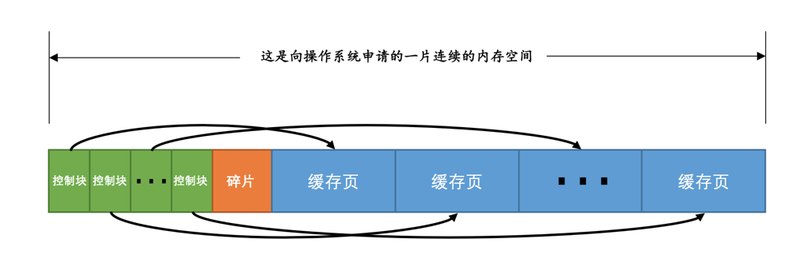

# Buffer Pool

为了缓存磁盘中的页，MySQL在启动时会申请一块内存区域，被称为Buffer Pool（缓冲池）。缓冲池被划分为若干个页，每个页的大小和表空间大小一致也是16KB，其结构如下图所示：

其中控制信息可以看作是缓存页的头部信息，记录了页所属的表空间编号、页号、缓存页在Buffer Pool中的地址等信息，控制块和缓存页是一一对应的，通过控制块就可以找到缓存页。MySQL在启动时会把所有缓存页放进一个空闲链表中，当把一个页从磁盘加载到缓冲池中，就从空闲链表中取一个控制块，然后把其从链表中移出。

MySQL会维护一个哈希表，当我们要访问一个页时，可以通过表空间号+页号作为key查看是否有对应的缓存页，如果没有就从磁盘中加载到缓冲池中，如果有则直接使用缓存页。

当一个缓存页被修改后，它就会和磁盘上的内容不一致，这样的页称为脏页，MySQL不会立刻把脏页数据刷新到磁盘上，而是会通过某种策略进行刷新。脏页会被记录在一个单独的链表中。

由于Buffer Pool大小有限，MySQL用一种类似LRU的策略对缓存进行淘汰，其结构如下图所示，整个LRU链表按一定比例分为2个区域，分别用于存储热数据和冷数据，热数据是指使用频率较高的数据，冷数据是指使用频率低的数据。

之所以分成两个区是因为在以下两种情况下，可能会降低Buffer Pool的缓存命中率（保存了大量并不频繁用到的页）。

1. MySQL的预读功能可能会加载一些不会用到的页到缓冲池中，导致一些真正有用的缓存被淘汰。
2. 全表扫描语句会加载大量数据到缓冲池中，并且每个页面会访问多次（读取一条记录算作一次），也会造成频繁访问某个页的假象。

针对第一种情况，MySQL规定首次加载一个页时，会先进冷数据区，这样那些后续不使用的预读进来的页就会被逐渐淘汰，而不影响热数据；针对第二种情况，对于从磁盘加载到冷数据区的页，如果第一次和最后一次访问该页的时间小于阈值（默认1秒），那么该页就不会加入到热数据区中。

MySQL会用专门的线程每隔一段时间把脏页刷到磁盘，如果脏页刷的比较慢，导致用户在从磁盘加载一个页到缓冲池时没有可用的缓存页，此时会先查看LRU链表的尾部是否有可以释放掉的未修改的缓存页，如果没有则需要把LRU链表尾部的一个脏页以同步的方式刷新到磁盘。

## 参考

1. 《MySQL是怎样运行的》
