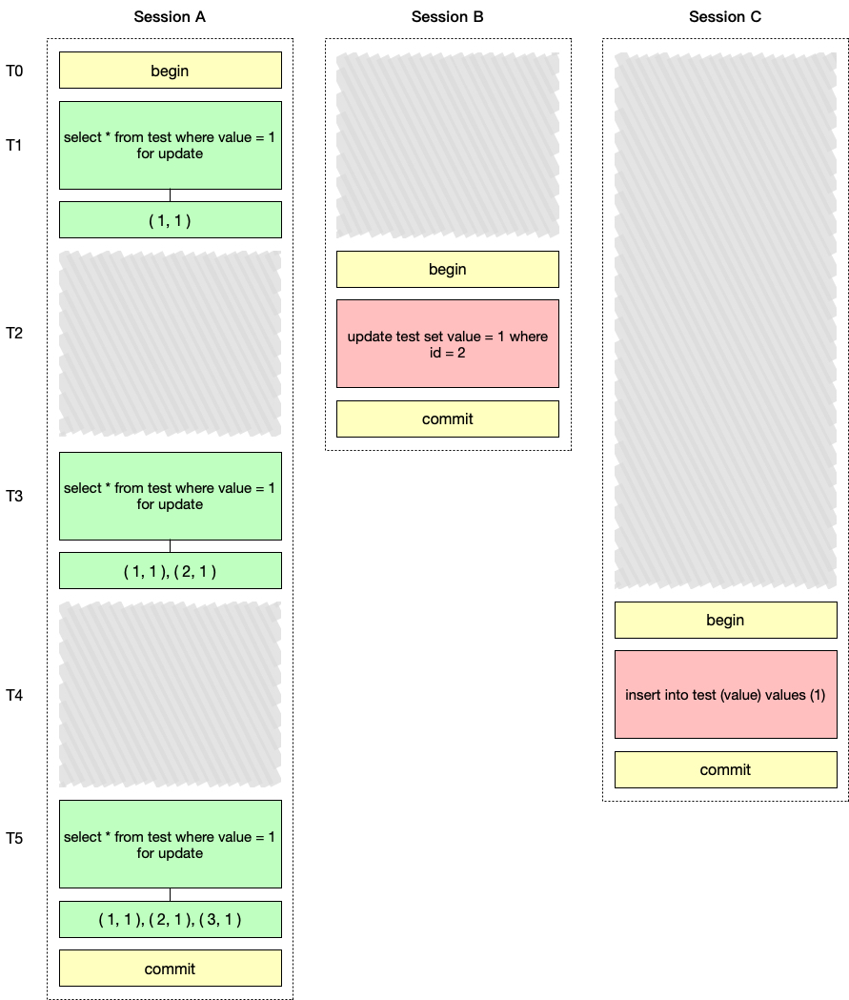
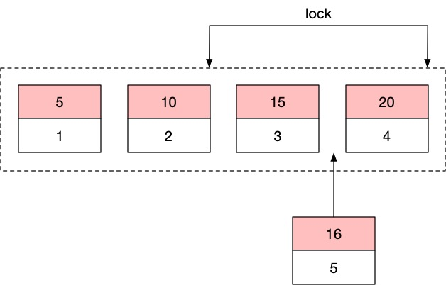
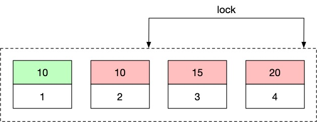

# 间隙锁

间隙锁是为了在可重复读的隔离级别下解决幻读的问题。

那么什么是幻读呢？

幻读是指一个事务中前后两次相同的查询（**这里的查询指当前读，比如SELECT FOR UPDATE**），后一次查询看到了前一次查询没有看到的记录，并且该记录是在当前事务执行期间**新插入**的行，下面看一个例子。

我们首先创建一张表，并往里插入一条数据。

```sql
CREATE TABLE `test` (
  `id` int(11) NOT NULL AUTO_INCREMENT,
  `value` int(11) DEFAULT NULL,
  PRIMARY KEY (`id`)
)

INSERT INTO test (value) VALUES (1);
INSERT INTO test (value) VALUES (10);

+----+-------+
| id | value |
+----+-------+
|  1 |     1 |
|  2 |    10 |
+----+-------+
```

在可重复读的隔离级别下，我们开三个会话分别进行以下的操作，并且假设`SELECT FOR UPDATE`语句只会锁住读取到的记录行。



在T1时刻，Session A使用`SELECT FOR UPDATE`语句将`value`等于1（即`id`为1）的行上锁。在T2时刻，Session B将`id`为2的行的`value`的值更新为1。在T3时刻，Session A将`value`等于1（即`id`为1和2的行）上锁，此时Session A可以看到2行记录。在T4时刻Session C插入一条`value`为1的数据。T5时刻，Session A将`value`等于1（即`id`为1、2和3的行）上锁，此时Session A可以看到3行记录。

在上面的例子中，有两处破坏了`SELECT FOR UPDATE`的语义。

1. 在T1时刻，Session A试图锁住所有`value`等于1的行，在T2时刻Session B把原本`value`是10的记录更新为1，该行没有被Session A锁定。
2. 在T1时刻，Session A试图锁住所有`value`等于1的行，但是在T4时刻新插入的`value`是1的行由于在T1时刻并不存在，因此也没有被Session A锁定。

针对第一种情况，我们只需要锁住查询过程中扫描到的行就能解决，在本例中`value`列没有索引，所以查询会进行全表扫描，所有扫描到的行都上锁，在T2时刻Session B的更新语句就会被阻塞，直到Session A把事务提交。但是这种情况不能称为幻读。

第二种情况就被称为幻读。由于导致幻读的是新增的行，因此即使把所有行都锁住也无法解决我们遇到的问题，为了解决这一问题MySQL引入了间隙锁，这也是幻读被单独拿出来解决的原因。

间隙锁的思想是把记录之间的间隙也上锁，比如下图中，假设表中有三行记录，它们的`value`值分别是1、10以及100，那么每个记录之前再算上正无穷、负无穷就可以产生4个间隙（图中黄色部分）。


当我们执行以下语句时，除了把扫描到的行加上行锁，还会给行两边的间隙加上间隙锁，当另一个事务向这些间隙中插入数据时就会被阻塞。

```sql
select * from test where value = 1 for update
```

对于上面的查询语句，当`value`列没有索引时，需要全表扫描，因此所有的列和列之间的间隙都会上锁，此时其它会话不能往表中插入任何数据；当`value`列存在索引时，所有`value`列为1的列以及其两边的间隙会上锁，也就是`(-∞, 10)`的范围内会上锁，其它会话在这个范围以外允许插入数据。

间隙锁和行锁合称`next-key lock`。

在MySQL中，在可重复读的隔离级别下间隙锁就会生效，因此我们上面的例子实际上并不能执行。如果一定要执行，可以将事务隔离级别设置为提交读，这样间隙锁就不会生效，也就会产生幻读的现象。

```sql
SET TRANSACTION ISOLATION LEVEL READ COMMITTED
```

需要注意的是，**在可重复读的隔离级别下，如果没有间隙锁，只有“当前读”才会存在幻读的问题，比如`SELECT FOR UPDATE`或`UPDATE`语句，而普通查询`SELECT`语句是快照读，因此不存在幻读问题。**

## 例子

我们创建一张新的测试表，往里插入几条数据，使它变成下面的样子。

```sql
CREATE TABLE `user` (
  `id` int(11) NOT NULL AUTO_INCREMENT,
  `age` int(11) DEFAULT NULL,
  PRIMARY KEY (`id`),
  KEY `user_age_index` (`age`)
)

INSERT INTO user (id, age) VALUES (1, 5);
INSERT INTO user (id, age) VALUES (2, 10);
INSERT INTO user (id, age) VALUES (3, 15);
INSERT INTO user (id, age) VALUES (4, 20);

+----+------+
| id | age  |
+----+------+
|  1 |    5 |
|  2 |   10 |
|  3 |   15 |
|  4 |   20 |
+----+------+
```

此时`age`列的索引如下图所示。


我们创建一个会话执行以下语句。

```sql
update user set age = 15 where age = 15;
```

因为间隙锁的存在，`age`列在`(10, 20]`范围的索引会被锁住。

> 为什么是(10,20]? 这是因为age是15的记录可能出现在(2,10)到(3,15)的区间内，也可能会出现在(3,15)到(4,20)的区间内。


这时，另一个会话尝试插入一个`age`为16的值就会被阻塞。

```sql
insert into user (age) values (16);
```



如果另一个会话尝试把`age`为20的行更新为10也会被阻塞，这是因为假设更新成功，那么更新后的索引如下所示，被更新的节点在间隙锁的范围内，因此无法更新。

```sql
update user set age = 10 where age = 20;
```


但是如果尝试更新`age`为5的行就可以更新成功，更新后的索引如下图所示，可以看到被更新的节点不在间隙锁范围内。

```sql
update user set age = 10 where age = 5;
```



**InnoDB会在所有可能会出现幻读的地方都加上间隙锁，而并不一定是只加在某一个记录的前面或者后面的区间。**
