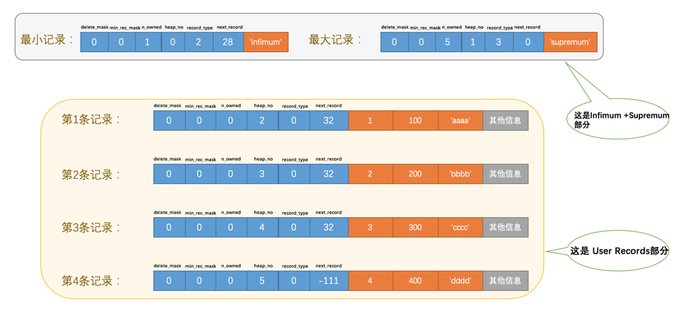
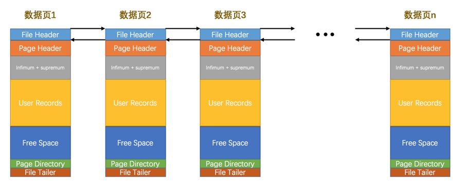
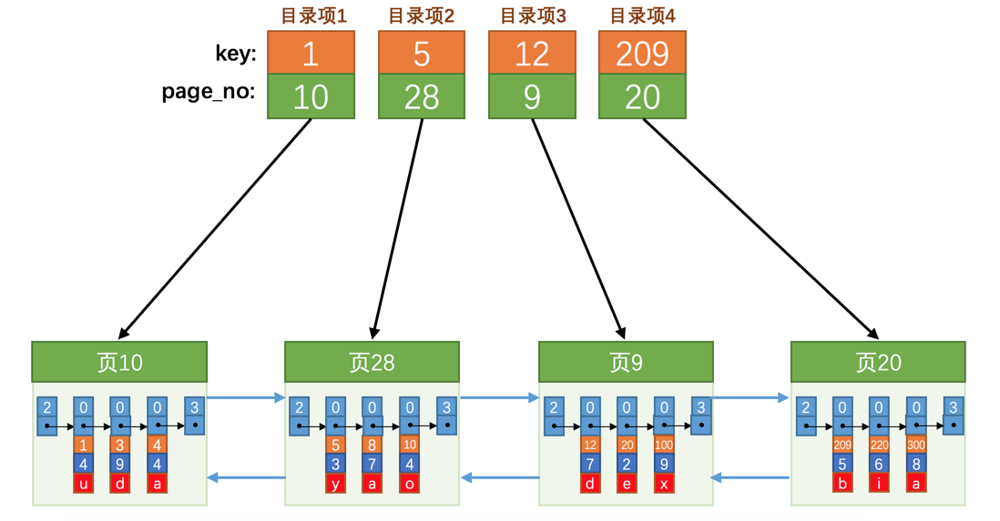
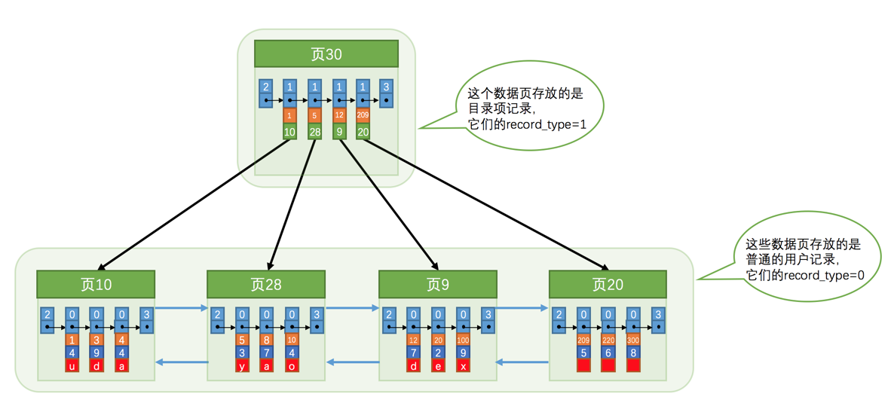
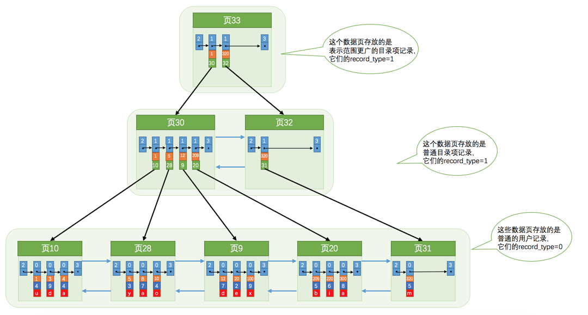
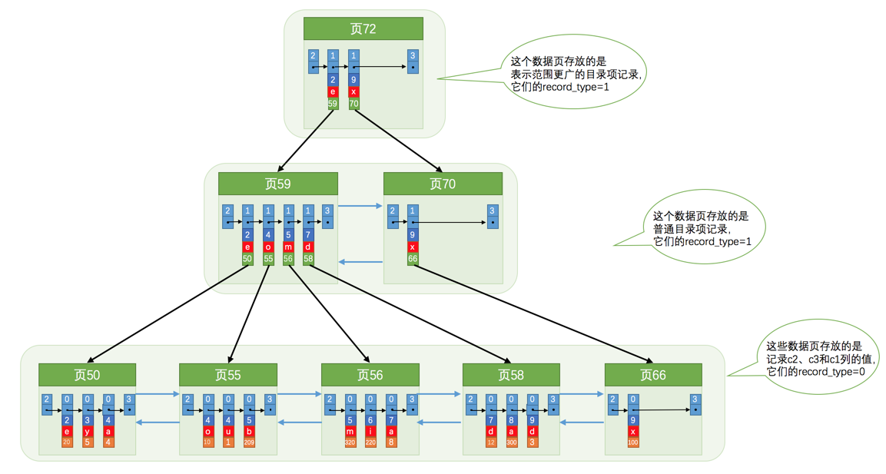
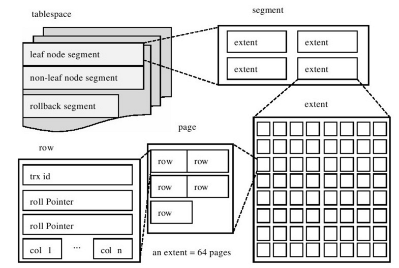
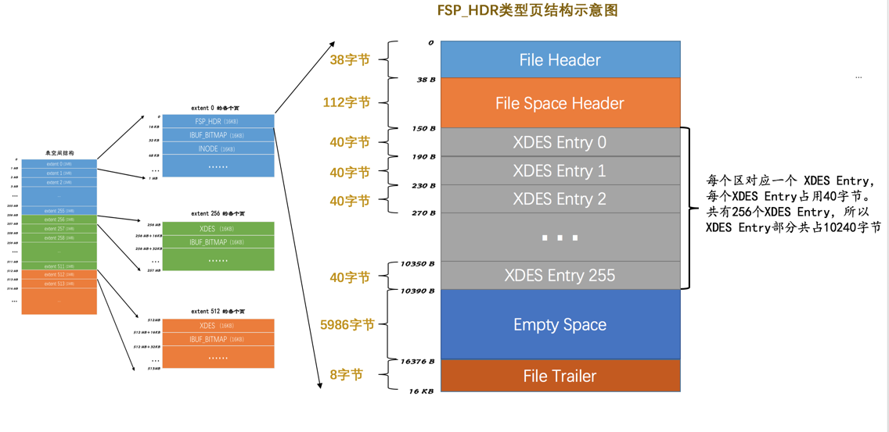
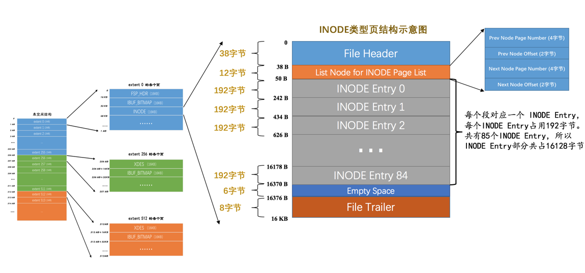
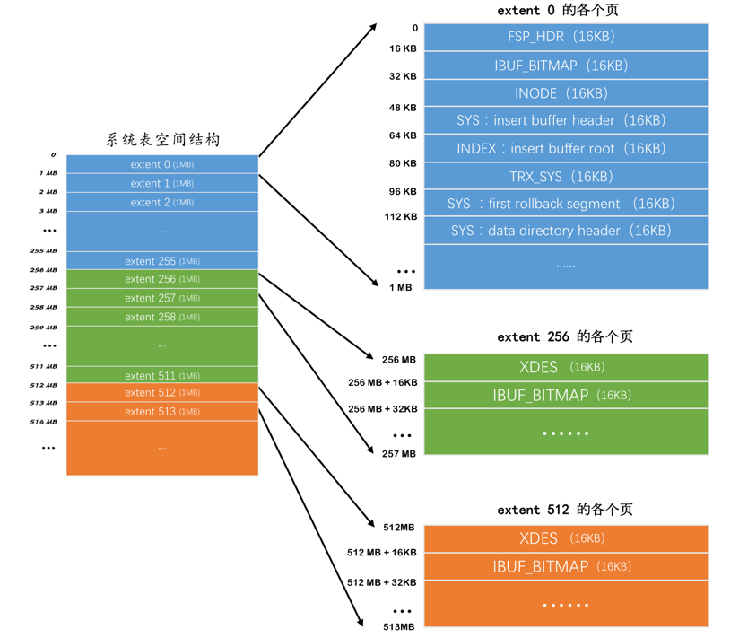

# InnoDB

## 数据行格式

InnoDB有以下四种类型的数据行格式。

### COMPACT

1. 变长字段长度列表
存储可变长数据类型实际占用的字节数，如varchar(n)、text类型的数据，不存储NULL值列的大小，字节数按照列的顺序逆序存储。对于定长数据类型比如char(n)，如果它采用了变长编码字符集如utf8（每个字符占用1～3字节），那么该列占用的字节数也会记录到变长字段长度列表中。对于采用定长编码的定长数据类型则不会记录到变长字段长度列表中，如采用ascii编码（每个字符占用1字节）的char(n)类型数据。

2. NULL值列表
用二进制位记录列的值是否是NULL。

3. 记录头信息
用二进制位记录的一些特殊标识，如删除标记、记录的类型等。

- delete_flag: 删除标记。
- record_type: 记录的类型。
- heap_no: 表示当前记录在本页中的位置。比如下面的例子中，主键是1、2、3、4的记录的heap_no分别是2、3、4、5依次增加。

InnoDB会自动给每个页添加heap_no是0和1的记录，分别是`Infimum`以及`Supremum`记录，`Infimum`表示当前页中最小的记录，`Supremum`表示当前页中最大的记录。

- next_record: 下一条记录的相对位置。如果该值是正数则表示下一条记录在当前记录的后面，否则表示下一条记录在当前记录的前面。比如下图中的第1条记录的next_record值是32，表示从记录的真实数据地址向后32字节处就是下一条记录的真实数据；第4条记录的next_record值是-111，表示从记录的真实数据地址向前111字节处就是下一条记录的真实数据。

用箭头表示上图会更加清晰：

如果此时删掉第2条记录，只需要更新第1条记录的next_record值，第2条记录并不会从存储空间中移除。

我们可以注意到，next_record并不指向下一条记录开始的位置，而是指向真实数据的地址，从这个位置向左可以读取记录头信息，向右可以读取真实数据，这也是变长字段长度列表按列的顺序逆序存储的原因。

4. 记录的真实数据
存储列的值，除了用户定义的列以外，Inndb还会为每行记录添加以下的隐藏列：

|       列名       |                        描述                              |
|------------------|---------------------------------------------------------|
|     DB_ROW_ID    | 该列只有在满足一定条件时才会自动添加，详见[主键](#主键)一节      |
|     DB_TRX_ID    | 事务ID                                                   |
|   ROLL_POINTER   | 回滚指针                                                  |

### REDUNDANT

1. 字段长度偏移列表
存储了一条记录中所有列的长度信息，并按照列的顺序逆序排列。每一列的长度需要通过当前列的偏移量减去上一列的偏移量得到。REDUNDANT格式没有单独的NULL值列表，设计者把每一列偏移量的首个比特位作为是否是NULL的标识。

2. 记录头信息
用二进制位记录的一些特殊标识，如删除标记、记录的类型等。

3. 记录的真实数据
存储列的值，和COMPACT格式类似。

### DYNAMIC

DYNAMIC格式与COMPACT格式类似，但在发生列溢出时（详见[列溢出](#列溢出)一节）不会在当前记录存储真实数据，而是把所有数据都存储到溢出页中。

### COMPRESSED

与DYNAMIC格式类似，区别是它会对页进行压缩以节省空间。

## 列溢出

如果一条记录中某一列的数据过多，当达到一定阈值时InnoDB会把多余的数据存储到其他页中。

## 主键

InnoDB的主键生成策略是：

1. 如果用户定义了主键则使用优先使用该列作为主键。
2. 如果用户没有定义主键，则选取一个不允许是NULL值的UNIQUE键作为主键。
3. 如果以上都不满足，则InnoDB会为表添加一列隐藏列`DB_ROW_ID`作为主键。

## 索引页

页是InnoDB管理存储空间的基本单位，大小通常是16K。InnoDB有多种不同用途的页，存储记录的页称为索引页，其结构如下图所示。

记录存储在User Records区域，但在一开始生成页时其实没有User Records区域，每次插入记录时会从Free Space部分申请一个记录大小的空间划分到User Records区域。当Free Space空间耗尽时再有新增记录就需要申请一个新的页了。从图中还可以看到`Infimum`以及`Supremum`记录存放在Infimum+Supremum区域，而不是User Records区域。

InnoDB在存储数据时会把记录按照主键的大小，从小到大顺序排列，这样当我们用主键进行查询时就需要对记录进行遍历（算法复杂度O(n)），为了提高查询的效率，InnoDB将页中记录的划分成多个组（不包括被标记为删除的记录），每个组内部的记录从小到大排列，并把最后一条记录（也就是每个组最大的那条记录）在页中的地址偏移量提取出来存放在一个单独的区域中，这个区域被称为Page Directory（页目录）。

用箭头表示上图：

记录头信息中的n_owned表示记录所在的分组中共有几条记录。有了这些分组，我们就可以通过二分法来快速通过主键进行查找。

Page Header部分存储了一些状态信息，比如当前页存储了多少条记录、Free Space的地址偏移量、记录分组数量等。

File Header是各类型页通用的（非索引页特有），它存储了一些页的通用信息，如页号（代表该页在磁盘文件中的偏移量，比如页号1表示偏移量为1*16KB）、上一个页的页号、下一个页的页号、页的类型等。其中，上一个页的页号与下一个页的页号把多个页串成一个双链表。

File Trailer也是各类型页通用的，它存储了页的校验和，用于检验页是否完整。

## 索引

当我们有多个索引页时，其结构如下图所示：

此时，如果我们要通过主键查找数据，那么需要执行以下两个步骤：

1. 定位到记录所在的页
2. 从页中找到符合条件的记录

为了快速定位到记录所在的页，InnoDB引入了索引。大致思想和用户记录中的分组类似，对页进行分组，使得页也能够用二分法进行查找。

InnoDB的具体做法则是复用了索引页的方案，把索引变成特殊的用户记录，我们称为目录项记录，目录项记录的记录头信息中record_type的值是1，而用户记录则是0。目录项记录只有主键和页的编号两列，而用户记录包含用户定义的所有数据列以及隐藏列。

索引也可以有多级，上层都是目录项记录，最下层才是用户记录。

上面这种根据主键进行划分，并包含了完整用户记录的索引称为聚簇索引，也叫主键索引，可以看到索引和数据是存储在一起的。

我们也可以为非主键列建立索引，和聚簇索引不同的是这种索引的最底层存储的不是完整的用户记录，仅仅存储建立索引的列以及主键列的值，因此如果想要通过非主键索引查找到完整的用户记录需要再去聚簇索引种进行二次查询（也叫回表操作），这种索引也称为二级索引。

> 当出现大量回表操作时，由于主键时随机的，可能分散在不同的页中，从而会产生大量的随机I/O，影响性能。

此外，我们还可以为多个列建立联合索引，它和二级索引的区别就是在目录项记录和用户记录中会包含多个建立索引的列。

每建立一个索引，InnoDB就会为其创建一棵B+树，每个节点对应一个页。

## 表空间

表空间是页的容器，由于页号占4个字节，因此一个表空间可以容纳232个页，每个页16KB，因此最多容纳64TB的页。

InnnoDB又把表空间分为独立表空间和系统表空间。

### 独立表空间

每个独立表空间都对应磁盘上的一个物理文件，命名形式为**表名.ibd**。为了更好的管理页，InnoDB把**物理上**连续的64个页分为一个区（称为extent），每256个区又被分为一组。

区的意义在于可以批量的申请物理上连续的页。当我们有大量数据需要插入时，如果以页为单位申请空间，可能申请到的多个页之间物理距离较远，这样就会生产随机I/O，如果我们以区为单位申请空间（如果表中数据量非常多还可以申请多个连续的区），那么就可以得到多个物理上连续的页。由于每个区内的页都是物理上连续的，因此一个区内的页号也是连续的。

当我们进行查询时，MySQL有时需要对用户记录进行顺序扫描（比如范围查询），在这种情况下并不需要扫描目录项记录，因此InnoDB把用户记录和目录项记录分别存储在独立的区中，这样就构成了两个集合，一个是存放用户记录的区的集合，另一个是存放目录项记录的区的集合，InnoDB把这样的集合称作段（Segment），前者可以称为数据段，后者可以称为索引段。因此，InnoDB的存储层级是表空间->段->区->页->用户记录，如下图所示（图中叶子节点指用户记录，非叶子节点指目录项记录）。

InnoDB会对每一个索引生成两个段（分别是数据段和索引段），而段是以区为单位申请空间的，又因为区的大小是1MB（64 * 16KB），因此每一个索引至少会产生2MB的大小，这对于数据量小的情况比较浪费。为了提高空间的利用率，InnoDB引入了碎片区（Fragment）的概念，一个碎片区中的页可以存储不同段的数据，而不是一个区内的页都被一个段所独占。为段分配存储空间的策略是：在刚开始向表中插入数据的时候，段是从某个碎片区以单个页面为单位来分配存储空间的，当某个段已经占用了32个碎片区页面之后，就会以完整的区为单位来分配存储空间。因此**段是一些零散的页面以及一些完整的区的集合**。

InnoDB使用名为XDES Entry的数据结构表示一个区，其结构如下：

其中：

- Segment ID：表示所属段的ID。
- List Node：XDES Entry组成的链表。
- State：表示区的状态，有以下四种。
    1. FREE：空闲的区，区内的页都还没有使用。
    2. FREE_FRAG：有剩余空间的碎片区，表示碎片区中还有可用的页。
    3. FULL_FRAG：没有剩余空间的碎片区，表示碎片区中的所有页面都被使用。
    4. FSEG：附属于某个段的区。
    前三种状态的区都是属于表空间的，而FSEG状态的区是属于某个段的。
- Page State Bitmap：共128个比特位，分成64对，也就是该区上没一个页有一对比特位，每对的第一个比特为表示对应的页是否空闲，另一个比特位暂时没有作用。

InnoDB使用名为INODE Entry的数据结构表示一个段，其结构如下：

- Segment ID：表示段的ID。
- NOT_FULL_N_USED：表示NOT_FULL链表中已经使用了多少个页面。
- List Base Node：分别对应三个链表。
    1. FREE链表：存储了同一个段中所有页面都是空闲的区对应的XDES Entry。
    2. NOT_FULL链表：存储了同一个段中仍有空闲空间的区对应的XDES Entry。
    3. FULL链表：存储了同一个段中已经没有空闲空间的区对应的XDES Entry。
- Magic Number：标记INODE Entry是否已经被初始化。
- Fragment Array Entry：每个元素对应一个零散的页，表示一个零散页的页号。

一个表空间的结构如下图所示：

其中，第一个区的前三个页的类型是固定的。

- FSP_HDR页

该类型的页存储了表空间的一些属性，其结构如下：

其中，File Space Header用来存储表空间的一些属性，如下图所示。比较重要的是其中几个链表：List Base Node for FREE List	、List Base Node for FREE_FRAG List、List Base Node for FULL_FRAG List，分别代表了状态是FREE的区的链表、状态是FREE_FRAG的区的链表以及状态是FULL_FRAG的区的链表。InnoDB会把处于这三种状态的区对应的XDES Entry结构组成三个链表。当我们向段插入数据时，在起初数据较少时会先查看表空间中是否有状态为FREE_FRAG的区，如果有，就从该区中取一些零碎的页把数据插进去；否则到表空间下申请一个状态为FREE的区，也就是空闲的区，把该区的状态变为FREE_FRAG，然后从该新申请的区中取一些零碎的页把数据插进去，之后不同的段使用零碎页的时候都会从该区中取，直到该区中没有空闲空间，然后该区的状态就变成了FULL_FRAG。以上步骤对应的链表操作是：把FREE_FRAG链表的头节点拿出来，从这个节点中取一些零碎的页来插入数据；当这个节点对应的区用完时，就修改一下这个节点的State字段的值，然后从FREE_FRAG链表中移到FULL_FRAG链表中。如果FREE_FRAG链表中一个节点都没有，那么就直接从FREE链表中取一个节点移动到FREE_FRAG链表的状态，并修改该节点的STATE字段值为FREE_FRAG，然后从这个节点对应的区中获取零碎的页来插入数据。当段中数据占满了32个零散的页后，就会申请完整的区来插入数据了，此时就会用到段中的三个链表：FREE链表、NOT_FULL链表以及FULL链表。

此外，List Base Node for SEG_INODES_FULL List和List Base Node for SEG_INODES_FREE List是两个存储INODE类型的页的链表。SEG_INODES_FULL链表中的页都没有多余的空闲空间，而SEG_INODES_FREE链表中的页还有空闲空间。

File Space Header下面的XDES Entry部分存储区的信息。

- XDES页

每个表空间中除了第一组的第一个页是FSP_HDR类型，剩下组的第一个页都是XDES类型的页，主要存储了XDES Entry。

- IBUF_BITMAP页

记录了Change Buffer相关的信息，当我们新增或更新数据时，InnoDB会把修改暂时缓存到Change Buffer中，等满足一定条件后再把修改合并到对应的页中以提高性能。

- INODE页

主要存储了INODE Entry。在创建INODE Entry时先看看SEG_INODES_FREE链表是否为空，如果不为空，直接从该链表中获取一个节点，也就相当于获取到一个仍有空闲空间的INODE类型的页，然后把该INODE Entry放到该页中。当该页中无剩余空间时，就把该页放到SEG_INODES_FULL链表中；如果SEG_INODES_FREE链表为空，则需要从表空间的FREE_FRAG链表中申请一个页，修改该页的类型为INODE，把它加到SEG_INODES_FREE链表中，最后把该INODE Entry放入该页中。INODE页中的List Node for INODE Page List存储上一个INODE页面和下一个INODE页面的指针。

### 系统表空间

和独立表空间的每张表一个表空间不同，一个MySQL进程中只有一个系统表空间，但一个系统表空间在物理上可以对应一个或多个文件。
系统表空间的结构和独立表空间类似，但在表空间的开头，也就是第一个组中会有许多独立表空间中没有出现过的页类型。

这里主要关注页号为7的页，它存储了InnoDB数据字典相关的信息。数据字典是指一些数据库的元数据，比如某个表属于哪个表空间、表里有多少列、表有多少个索引、每个索引对应哪几个段等。InnoDB定义了几张内部表用来存储这些元数据。其中最重要的有下面四张表：

1. SYS_TABLES：记录了数据库中表的名称、列个个数、表的类型、所属表空间等信息。
2. SYS_COLUMNS：记录了列的名称、列所属的表、列的位置、数据类型等信息。
3. SYS_INDEXES：记录了索引所属的表、索引名称、索引根所在的页号、索引包含的列的个数等信息。
4. SYS_FIELDS：记录了列在索引列中的位置、列的名称等信息。

以上四张表被称为基本系统表，可以看作是表的表。我们无法直接查询这些内部表的数据，但是可以通过infomation_schema系统数据库来间接查询一些信息，infomation_schema中提供了一些INNODB_SYS开头的表，需要注意的是这些表和内部表并不是完全一致的。

下面我们看下7号页的结构，如下图所示，以Root开头的记录存储的就是基本系统表的聚簇索引、二级索引对应的根页的页号（由于这些表是表的表，因此需要特殊处理，单独用一个类型的页来记录），除此之外该页还存储了一些全局变量，比如Max Table ID（用于生成表的唯一ID），Max Index ID（用于生成索引的唯一ID）等信息。

## 参考

1. 《MySQL是怎样运行的》
