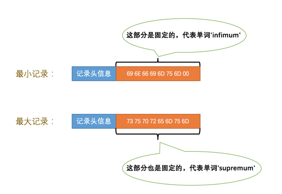
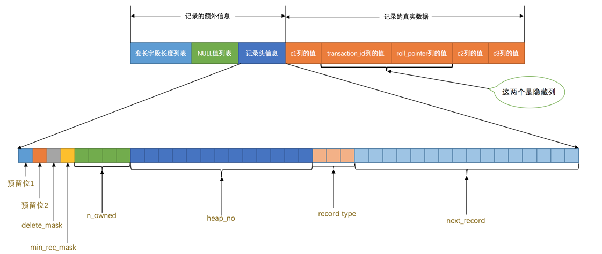
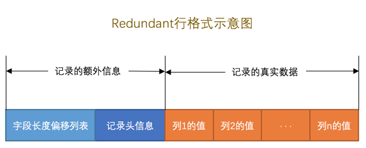
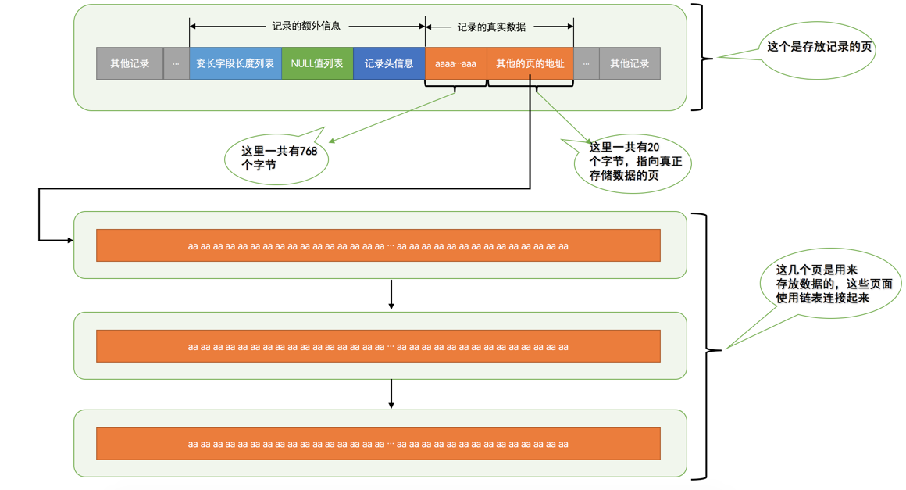
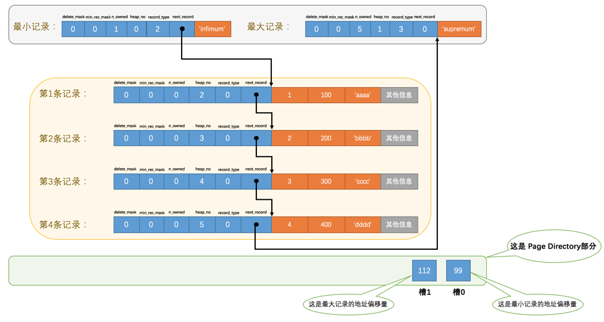
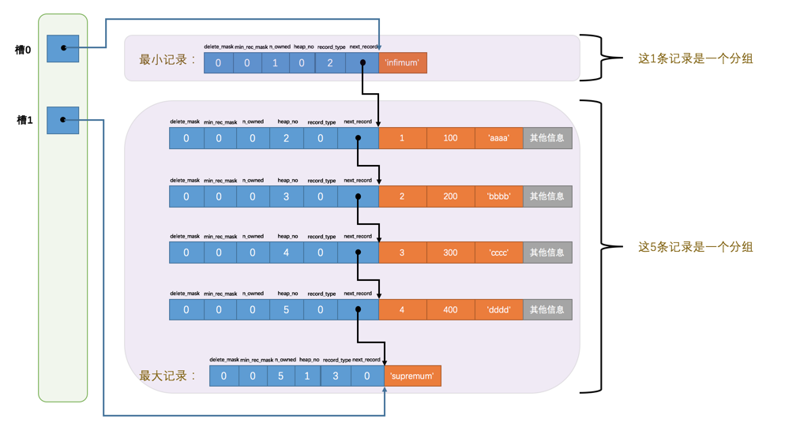

# InnoDB

## 数据行格式

InnoDB有以下四种类型的数据行格式。

### COMPACT

1. 变长字段长度列表
存储可变长数据类型实际占用的字节数，如varchar(n)、text类型的数据，不存储NULL值列的大小，字节数按照列的顺序逆序存储。对于定长数据类型比如char(n)，如果它采用了变长编码字符集如utf8（每个字符占用1～3字节），那么该列占用的字节数也会记录到变长字段长度列表中。对于采用定长编码的定长数据类型则不会记录到变长字段长度列表中，如采用ascii编码（每个字符占用1字节）的char(n)类型数据。

2. NULL值列表
用二进制位记录列的值是否是NULL。

3. 记录头信息
用二进制位记录的一些特殊标识，如删除标记、记录的类型等。

- delete_flag: 删除标记。
- record_type: 记录的类型。
- heap_no: 表示当前记录在本页中的位置。比如下面的例子中，主键是1、2、3、4的记录的heap_no分别是2、3、4、5依次增加。

InnoDB会自动给每个页添加heap_no是0和1的记录，分别是`Infimum`以及`Supremum`记录，`Infimum`表示当前页中最小的记录，`Supremum`表示当前页中最大的记录。

- next_record: 下一条记录的相对位置。如果该值是正数则表示下一条记录在当前记录的后面，否则表示下一条记录在当前记录的前面。比如下图中的第1条记录的next_record值是32，表示从记录的真实数据地址向后32字节处就是下一条记录的真实数据；第4条记录的next_record值是-111，表示从记录的真实数据地址向前111字节处就是下一条记录的真实数据。

用箭头表示上图会更加清晰：

如果此时删掉第2条记录，只需要更新第1条记录的next_record值，第2条记录并不会从存储空间中移除。

我们可以注意到，next_record并不指向下一条记录开始的位置，而是指向真实数据的地址，从这个位置向左可以读取记录头信息，向右可以读取真实数据，这也是变长字段长度列表按列的顺序逆序存储的原因。

4. 记录的真实数据
存储列的值，除了用户定义的列以外，Inndb还会为每行记录添加以下的隐藏列：

|       列名       |                        描述                              |
|------------------|---------------------------------------------------------|
|     DB_ROW_ID    | 该列只有在满足一定条件时才会自动添加，详见[主键](#主键)一节      |
|     DB_TRX_ID    | 事务ID                                                   |
|   ROLL_POINTER   | 回滚指针                                                  |

### REDUNDANT

1. 字段长度偏移列表
存储了一条记录中所有列的长度信息，并按照列的顺序逆序排列。每一列的长度需要通过当前列的偏移量减去上一列的偏移量得到。REDUNDANT格式没有单独的NULL值列表，设计者把每一列偏移量的首个比特位作为是否是NULL的标识。

2. 记录头信息
用二进制位记录的一些特殊标识，如删除标记、记录的类型等。

3. 记录的真实数据
存储列的值，和COMPACT格式类似。

### DYNAMIC

DYNAMIC格式与COMPACT格式类似，但在发生列溢出时（详见[列溢出](#列溢出)一节）不会在当前记录存储真实数据，而是把所有数据都存储到溢出页中。

### COMPRESSED

与DYNAMIC格式类似，区别是它会对页进行压缩以节省空间。

## 列溢出

如果一条记录中某一列的数据过多，当达到一定阈值时InnoDB会把多余的数据存储到其他页中。

## 主键

InnoDB的主键生成策略是：

1. 如果用户定义了主键则使用优先使用该列作为主键。
2. 如果用户没有定义主键，则选取一个不允许是NULL值的UNIQUE键作为主键。
3. 如果以上都不满足，则InnoDB会为表添加一列隐藏列`DB_ROW_ID`作为主键。

## 索引页

页是InnoDB管理存储空间的基本单位，大小通常是16K。InnoDB有多种不同用途的页，存储记录的页称为索引页，其结构如下图所示。

记录存储在User Records区域，但在一开始生成页时其实没有User Records区域，每次插入记录时会从Free Space部分申请一个记录大小的空间划分到User Records区域。当Free Space空间耗尽时再有新增记录就需要申请一个新的页了。从图中还可以看到`Infimum`以及`Supremum`记录存放在Infimum+Supremum区域，而不是User Records区域。

InnoDB在存储数据时会把记录按照主键的大小，从小到大顺序排列，这样当我们用主键进行查询时就需要对记录进行遍历（算法复杂度O(n)），为了提高查询的效率，InnoDB将页中记录的划分成多个组（不包括被标记为删除的记录），每个组内部的记录从小到大排列，并把最后一条记录（也就是每个组最大的那条记录）在页中的地址偏移量提取出来存放在一个单独的区域中，这个区域被称为Page Directory（页目录）。

用箭头表示上图：

记录头信息中的n_owned表示记录所在的分组中共有几条记录。有了这些分组，我们就可以通过二分法来快速通过主键进行查找。

Page Header部分存储了一些状态信息，比如当前页存储了多少条记录、Free Space的地址偏移量、记录分组数量等。

File Header是各类型页通用的（非索引页特有），它存储了一些页的通用信息，如页号、上一个页的页号、下一个页的页号、页的类型等。

File Trailer也是各类型页通用的，它存储了页的校验和，用于检验页是否完整。
