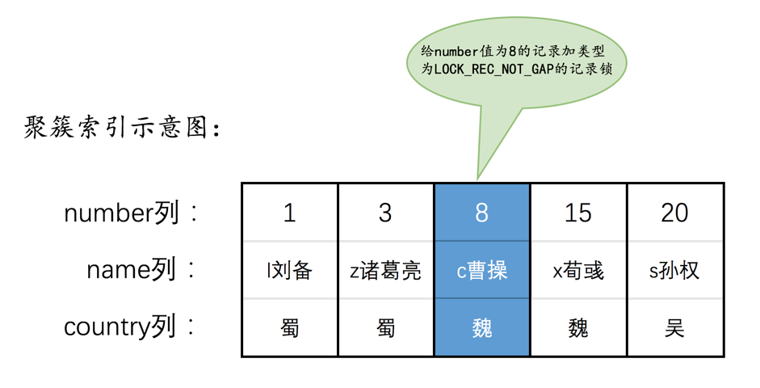

# 锁

## 表锁

### AUTO-INC锁

InnoDB对自增主键的实现方式有以下两种：

1. 在执行插入语句时加一个表级别的AUTO-INC锁，然后为自增列分配递增的值，在语句执行完成后再把锁释放掉。因此当一个事务执行插入语句时，其他事务会被阻塞。如果在插入时无法确定具体记录条数，比如使用INSERT ... SELECT这种语句，一般会采用这种方式生成自增列。

> 注意：AUTO-INC与其他锁不同，在语句执行完成后就释放，而不是在事务提交后释放。

2. 采用一个轻量级锁，在为自增列生成递增值时获取轻量级锁，一旦该列的值生成后就立刻释放锁而不需要等到整个语句执行完成。如果在插入时可以确定具体记录条数，一般会采用这种方式。

## 行锁

### Record Lock

Record Lock就是最普通的记录锁，其功能就是把一条记录上锁。

### Gap Lock

Gap Lock就是间隙锁，是指在记录之间的夹缝里上锁，使其他事务无法在一段区间内插入新记录。具体可以跳转到[这里](gap-lock.md)查看。Gap Lock用于在可重复读的事务隔离级别下避免出现幻读的问题。

### Next-Key Lock

Next-Key Lock本质就是Record Lock加上Gap Lock。

## 死锁

MySQL有一个死锁检测机制，当它检测到死锁时会将较小的事务进行回滚（较小的事务指插入、更新、删除记录条数较少的事务），并向客户端返回异常信息。

可以通过`show engine innodb status`查看最近一次发生死锁的信息，这条语句也可以查看当前活跃的事务加锁的信息。

## 参考

1. 《MySQL是怎样运行的》
