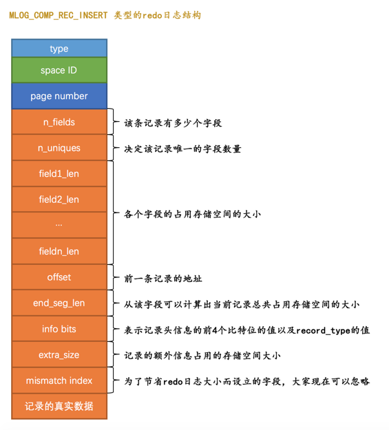
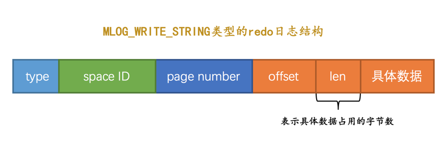
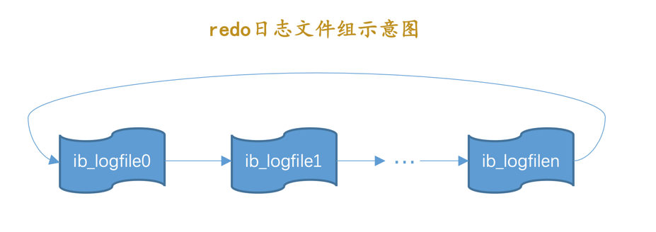

# Redo日志

当我们对数据库中的页进行修改后，出于性能考虑，变更并不是马上刷入磁盘的，而是先修改内存中Buffer Pool中对应的页，如果此时发生故障，这些变更过的数据就会丢失。因此引入了redo日志，通过它可以在数据库恢复后把数据还原到故障发生之前的时刻。无论是对数据页的修改还是对undo日志页的修改都会生成对应的redo日志。

redo日志的格式很多，我们主要看两种。

第一种是执行Insert语句时的redo日志，主要记录了插入时需要的参数，MySQL恢复数据时会根绝这些参数执行插入操作。

第二种比较直接，记录了在某个表空间的某个页的偏移位置写入数据。

如果在Insert时也采用第二种方式，那么由于插入操作可能会引起多个页的变更（比如更新多个索引、引起页分裂等），会导致redo日志记录的数据比较多。

有时候执行一条语句会产生多条redo日志，有一些redo日志必须以原子的方式执行，如果在数据库发生故障前只记录了部分redo日志，那么在数据库重启后会恢复到不正确的状态。比如在插入数据时，还没来得及新增目录项记录，数据库就发生了宕机，此时的redo日志是不完整的，在数据库重启后通过这部分不完整的redo日志就会把系统恢复到一个不正确的状态。redo日志中用一个比特位来表示是否是单一的日志，如下图所示：

如果不是单一日志，则在多个redo日志的最后一定有一个类型为MLOG_MULTI_REC_END的redo日志，表示这一组redo日志需要被原子的执行。在数据库重启进行恢复时，只有当解析到类型为MLOG_MULTI_REC_END的redo日志，才认为解析到了一组完整的redo日志，才会进行恢复。否则的话直接放弃前面解析到的redo日志。

redo日志并不是每生成一条就立刻刷盘的，而是写到一个缓冲区中，称为Log Buffer。当满足以下任意一个条件时才会刷盘：

- Log Buffer空间不足。
- 事务进行提交。
- 后台线程定时刷盘（约以每秒1次的频率）。
- 正常关闭数据库时。
- 做Checkpoint时。

> 未提交的事务对应的redo日志也会刷盘，如果在未提交前数据库发生了故障，那么事务需要在下一次重启后进行回滚，回滚则由undo日志执行。

在写redo日志文件时，先写入第1个文件，等第1个文件满了就去写第2个文件，依次类推，直到最后一个文件也写满，再回过头去写第1个文件（覆盖），这里文件的数量是可以进行配置的。

对于那些已经从Buffer Pool刷到磁盘的脏页，这部分的redo日志显然是可以丢弃的，因为已经持久化到硬盘，即使数据库发生故障重启后也不需要再通过redo日志把这部分脏页恢复。因此如果redo日志已经刷到磁盘，而对应的脏页还在Buffer Pool中，如果把这部分脏页也刷到磁盘上那么对应的的redo日志就可以被覆盖了（redo日志文件循环使用，因此容量是有限的），这一过程被称为Checkpoint。

## 参考

1. 《MySQL是怎样运行的》
