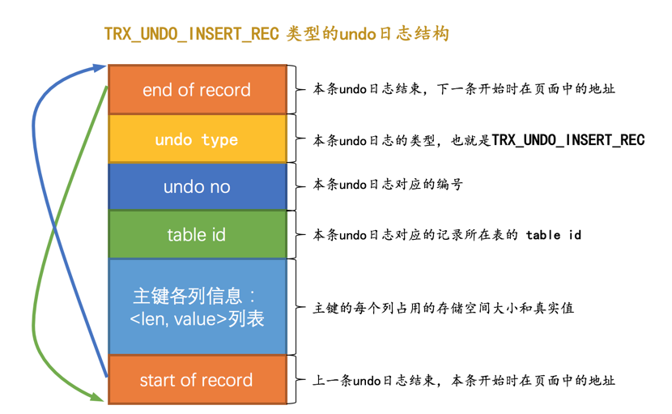
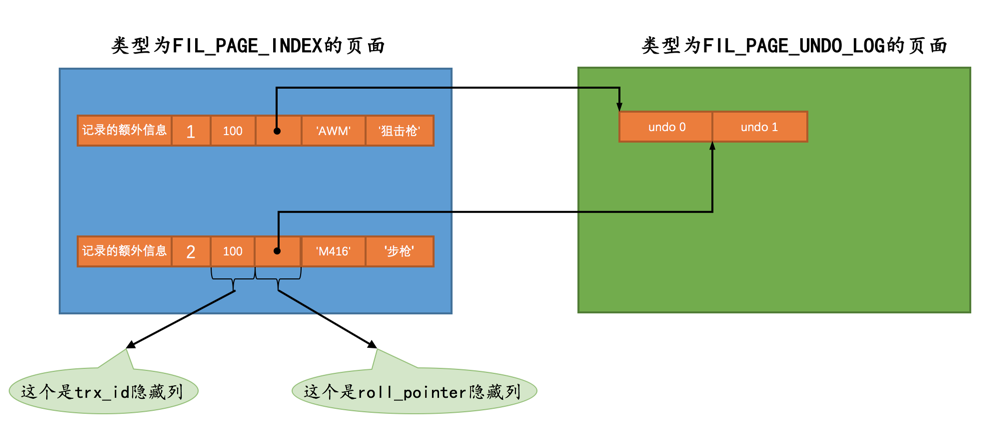
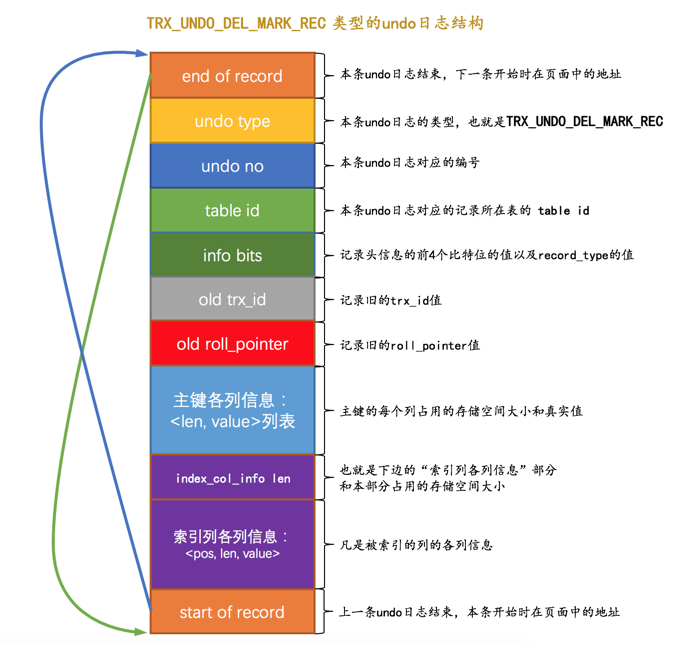
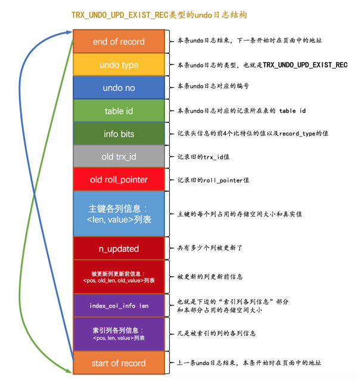
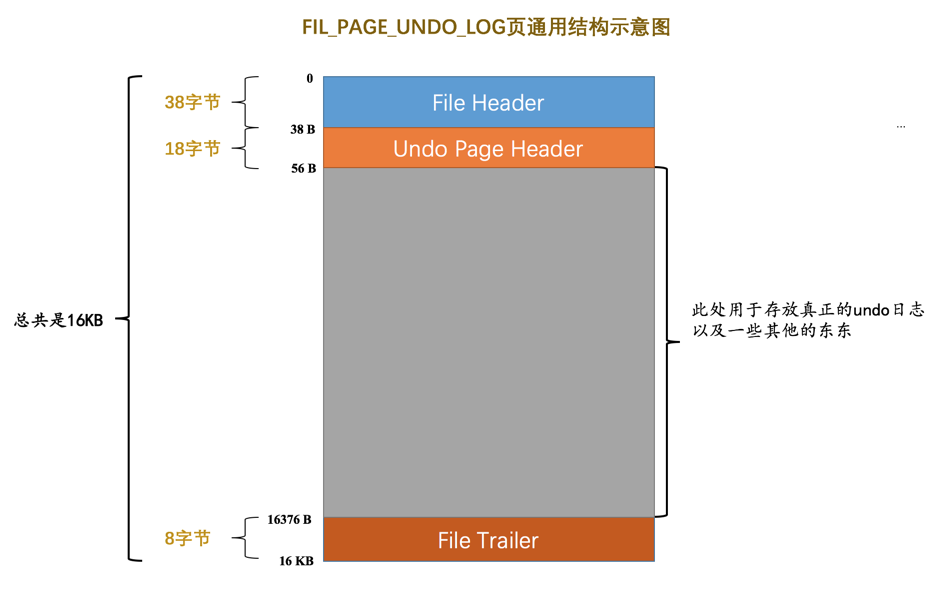
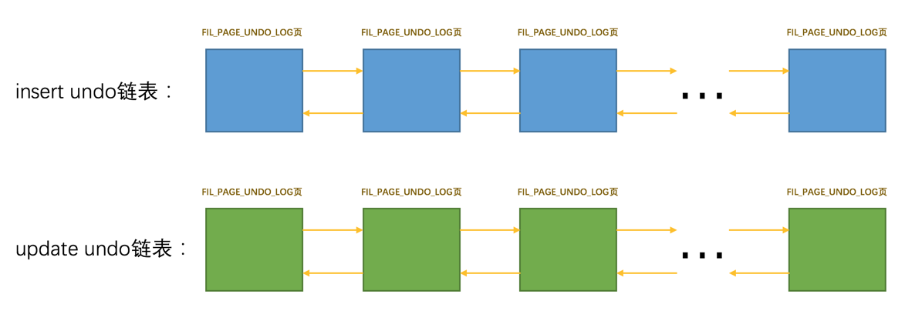
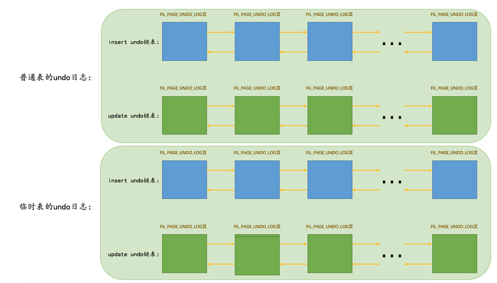
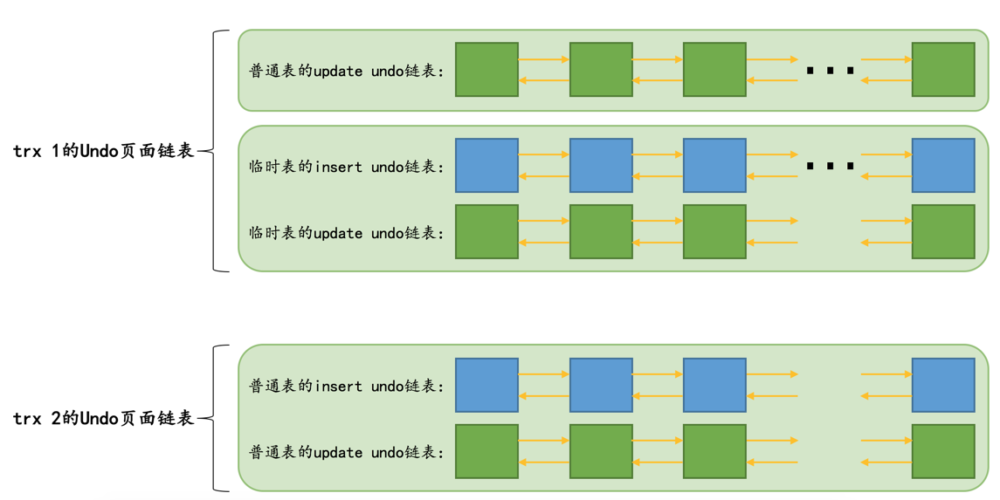

# Undo日志

undo日志用于对事务进行回滚，InnoDB在进行增删改操作时会先把对应的undo日志记下来，通常一条记录的一次改动对应一条undo日志，有时也会对应2条。undo日志所在的页可以从系统表空间分配，也可以从专门存放undo日志的表空间分配。

## Insert

一个Insert语句对应的undo日志结构如下：

当我们插入记录后，记录中有一个专门的字段`roll_pointer`指向对应的undo日志。

在回滚Insert操作时，只需要知道对应的主键信息，把聚簇索引和二级索引中对应的记录删去。

## Delete

当我们删除记录时，并不是立刻将这条记录从磁盘上删去，而是经历以下两个步骤：

1. 在事务提交前，MySQL会把记录的删除标识置为1，此时这条记录并没有被加到垃圾链表中（加入到垃圾链表中的记录占的存储空间可以被新的记录重新复用）。这个步骤称为delete mark。我们称这条记录处于中间状态。

2. 在事务提交后，会有专门的线程把该记录从正常记录链表中移出，并加入到垃圾链表中。这个步骤被称为purge。此时该记录所占的空间可以被复用。

因为步骤2已经提交了事务，所以在回滚Delete操作时只需要回滚步骤1中的操作。

Delete操作对应的undo日志结构如下：

## Update

针对更新记录的undo日志需要分以下几种情况讨论：

1. 不更新主键，原地更新

如果一条记录更新前后每个列占用的空间都一样，那么就可以在原记录的位置上进行更新。

2. 不更新主键，非原地更新

如果一条记录更新前后有任意一列占用的空间不同，那么就无法原地更新，此时需要原记录删除再插入一条新记录。

3. 更新主键

如果一条记录的主键被更新，则原记录需要被执行delete mark操作（也就是先打标记，不立刻删除），然后再插入一条新的记录。

Update操作对应的undo日志结构如下：

## Undo页

Undo日志记录在类型为FIL_PAGE_UNDO_LOG的页中，其结构如下图所示：

其中Undo Page Header部分记录了undo日志的类型、第一条undo日志在本页中的偏移量、最后一条undo日志结束时的偏移量，以及指向上一个页和下一个页的指针。

undo日志分为2大类：

- TRX_UNDO_INSERT：类型为TRX_UNDO_INSERT_REC的undo日志属于此大类，一般由INSERT语句产生，或者在UPDATE语句中有更新主键的情况也会产生此类型的undo日志。

- TRX_UNDO_UPDATE：除了类型为TRX_UNDO_INSERT_REC的undo日志，其他类型的undo日志都属于这个大类。一般DELETE、UPDATE语句会产生此类型的undo日志。

一个undo日志页只能存储一种类型的undo日志，不能两种类型混用。

一个事务可能包含多个语句，一个语句可能对若干条记录进行改动，对每条记录进行改动前都会记录1条或2条的undo日志，如果undo日志比较多导致一个页存放不下，那么就需要有多个页进行存储，这些页之间就会形成一个链表。

由于一个undo日志页只能存储一种类型的undo日志，因此undo日志的页链表也要分成2个分别存储TRX_UNDO_INSERT和TRX_UNDO_UPDATE类型的undo日志。

InnoDB规定针对普通表和临时表的undo日志要分别记录，因此一个事务中最多会有4个undo日志页组成的链表。这些链表只有在用到的时候才会进行分配，在事务刚开始时是不会立刻分配的。

事务之间的undo日志链表是相互独立的，每个事务都有自己的链表。

大部分事物可能只修改了少量的数据，如果每个事务在开始后都需要创建一个undo日志链表（只包含一个undo日志页），那么就比较浪费空间，因此为了提高空间利用率，在满足一定条件下可以复用undo日志页。

1. 链表中只包含一个undo日志页。
2. 该undo页已经使用的空间小于整个页空间的3/4。

对于普通表来说，在写undo日志前会先写对应的redo日志，这样在数据库崩溃重启后才能恢复到之前的状态，但对于临时表，在写undo日志时并不需要记录对应的redo日志。

针对那些在数据库发生故障时还未提交但对应的redo日志已经刷盘的事务，在数据库重启后需要根据undo日志对事务产生的页的更改全部回滚掉，这样就保证了事务的原子性。

## 参考

1. 《MySQL是怎样运行的》
