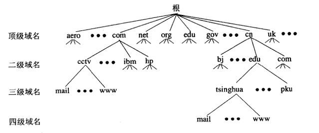

# DNS

从功能上看，DNS协议用于把域名转换为IP地址。从技术上看，DNS是一个分布式分层数据库，用于存储IP地址，并允许根据名称查询IP地址。

## 域名



域名末尾有一个隐藏的`.`代表根域名，在根域名之前的依次称为顶级域名、二级域名、三级域名等。通常在域名供应商处购买的域名是二级域名，如github.com。

## DNS服务器类型

- 根域名服务器
全球共有13组（非13台）根域名服务器，它存储了顶级域名服务器的地址。

- 顶级域名服务器
存储了权威域名服务器的地址。

- 权威域名服务器
权威域名服务器指管理二级、三级、四级等域名的域名服务器。

## 本地域名服务器

本地域名服务器也叫递归解析器，它是客户端和DNS域名服务器的中间人。客户端向本地域名服务器发送DNS解析请求后，本地域名服务器会执行一系列的步骤最后将查询结果返回给客户端。通常运营商会提供本地域名服务器，通过DHCP协议自动给客户端分配本地域名服务器的地址。也可以手动设置本地域名服务器的地址，比如常见的114.114.114.114，8.8.8.8等公共递归解析器。

## DNS解析过程

假设需要解析的域名是`github.com`。

1. 客户端首先查询本机DNS缓存，如果存在，则直接向缓存中的IP地址发起请求。
2. 如果本机缓存没有命中，则查询本机HOST文件是否有域名和IP地址的映射关系。
3. 如果HOST文件也没有映射关系，则向本地DNS服务器发送DNS请求。
4. 本地DNS服务器会先在本地缓存中进行查找，如果缓存命中则直接返回，否则继续下面的步骤。
5. 本地DNS服务器向根域名服务器发送请求，根域名服务器会返回顶级域名`.com`对应的顶级域名服务器地址。
6. 本地DNS服务器向顶级域名服务器发送请求，顶级域名服务器会返回二级域名`github.com`对应的权威域名服务器地址。
7. 本地DNS服务器向权威域名服务器发送请求并得到IP地址。
8. 本地DNS服务器将查询结果进行缓存并返回给客户端。

## DNS记录

域名服务器可以配置DNS记录，一条DNS记录提供了一个域名的相关配置，比如域名对应的IP地址。记录也分不同的类型，常用的几种类型如下所示：

- A
域名映射到IPv4地址。
- AAAA
域名映射到IPv6地址。
- CNAME
域名别名，即映射到另一个域名，比如将`www.example.com`映射到到`example.com`。
- NS
域名服务器记录，记录了哪个服务器包含真正的DNS记录，即权威域名服务器的地址。
- MX
映射到邮件服务器。
- TXT
保存域名附加的文本信息，可以是对人可读的，也可以是对机器可读的，长度限制255。
- SOA
提供域名的授权信息，包括主要DNS服务器地址（即主要权威域名服务器的地址）、域名管理员的邮箱、域名信息序列号（每次更新序列号需要增加）、备用DNS服务器刷新时间间隔（从主DNS服务器拉取信息）等信息。
- SRV
记录服务器能提供什么样的资源，包括服务名、协议名、端口号等信息。
- PTR
将IP地址指向域名。可用于反向查询，即通过IP地址查询域名。

## 工具

使用`dig`工具查询DNS信息。

```bash
# 指定DNS服务器查询
dig [@dns-server] example.com [DNS记录类型]

# 反向查询
dig -x ip
```

## 参考

1. [《DNS入门：域名结构与域名服务器》](https://zhuanlan.zhihu.com/p/38282917)
2. [《谷歌云》](https://cloud.google.com/dns/docs/dns-overview?hl=zh-cn)
3. [《What is an SOA Record in DNS?》](https://www.itgeared.com/articles/1132-what-is-soa-record-in-dns/)
