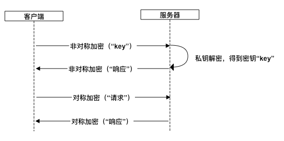
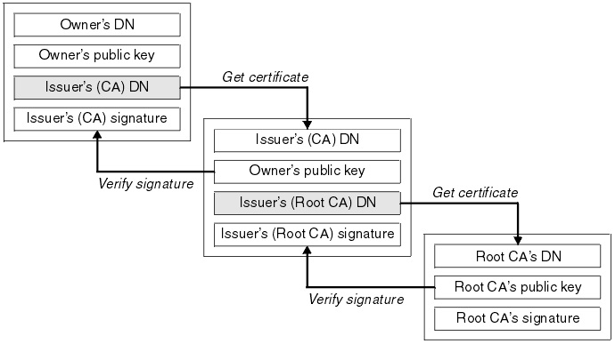
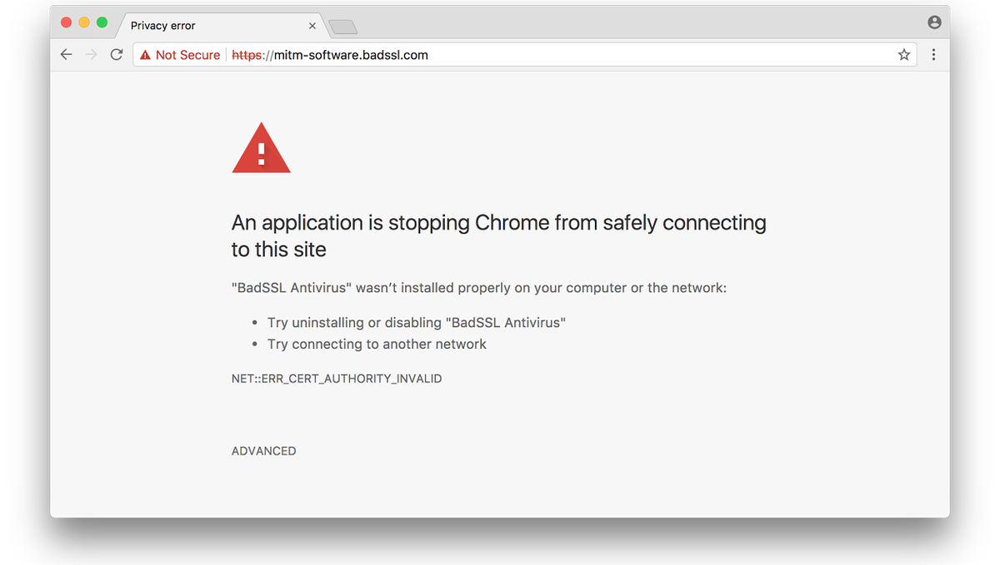

# HTTPS

由于HTTP协议本身没有对传输内容进行任何加密并且客户端和服务端进行连接时也没有身份验证的机制，因此黑客就有机会伪造身份、监听或篡改信息。

为了解决上述安全问题，我们可以使用加密算法对内容进行加密。

## 加密

### 方案一：对称加密

对称加密就是加密和解密用同一个密钥。客户端把要传输的消息用密钥进行加密，然后服务端用同一个密钥进行解密，反之亦然。

这种方式有以下几个缺点。

1. 客户端和服务端需要协商密钥，因为还没有密钥因此需要用明文传输密钥，存在泄漏的可能。
2. 客户端和服务端需要维护大量的密钥，浪费资源。

常用的对称加密算法有AES、DES。

### 方案二：非对称加密

非对称加密有一对密钥，分别叫做公钥和私钥，可以用任意一个密钥加密然后用另一个密钥解密，公钥是公开的，私钥只是自己持有。在这种模式下服务端只需维护一对密钥，客户端发送请求时使用服务端公开的公钥对内容进行加密，服务端收到请求后用私钥进行解密；在返回消息时，服务端使用私钥进行加密，客服端收到后用公钥进行解密。

这种方式的缺点是，在服务端返回消息时，一旦消息被黑客截获，由于公钥是公开的，那么黑客也可以进行解密。此外非对称加密的效率通常比对称加密低。

常见的非对称加密算法有RSA、ElGamal。

### 方案三：对称加密+非对称加密

如果我们能解决方法一中客户端和服务端协商密码时密钥泄露的问题，那么在之后的传输中即使黑客截获了消息，也无法对解惑的消息进行解密了。

那么如何改进方法一呢？答案是用方法二的非对称加密来传输方法一中的密钥。客户端使用非对称加密中的公钥把对称加密中的密钥进行加密并发给服务端，服务端用私钥进行解密后就得到了客户端发来的密钥，之后的数据传输就可以用方法一中对称加密的方式了。HTTPS就是采用这种方案。



## 数字证书

那么HTTPS是如何拿到公钥呢？

最直接的方法就是向服务端发起一个请求来获取公钥，但是如果传输过程中被黑客截获并篡改，客户端无法察觉，并且会误以为这就是真正的公钥，在接下来的过程中客户端会用黑客返回的公钥与黑客的服务端进行数据传输，这样就出现了严重的安全漏洞。因此我们需要有一种机制来验证公钥的真实性。

你也许会想到服务端可以为公钥计算出一个哈希值并且和公钥一起发给客户端，客户端收到后可以计算出哈希值然后和服务端发来的哈希值进行比对判断公钥是否被篡改。但是不要忘了黑客也可以计算哈希值，他可以返回一个假的公钥和假公钥对应的哈希值，同样能通过客户端的验证，因此我们需要对哈希值进行加密。服务端用它的私钥对哈希值进行加密，客户端用公钥进行解密，计算出公钥的哈希值后和解密出的哈希值进行比对来验证公钥的真实性，那么这里的公钥又要从哪里获取呢？

HTTPS通过数字证书（Certificate）和证书颁发机构（Certificate Authority，CA）来解决上述问题。证书中包含公钥、发布机构、有效期等信息，由某个证书颁发机构（Certificate Authority，CA）进行颁发，CA根据证书的内容计算出一个哈希值并用私钥进行加密，客户端用CA的公钥进行解密，得到哈希值后校验证书是否被篡改。重点来了：**各大CA的公钥是内置在操作系统或浏览器中的**。黑客无法伪造证书，因为他们没有CA的私钥。这套机制可靠的前提是我们认为CA是可信的，厂商需要向CA提交域名等信息申请认证，如果通过审核，那么CA就会签发证书。

我们可以使用`openssl`工具创建一个证书。

```bash
# 创建证书
openssl req -new -x509 -newkey rsa:1024 -keyout demo.key -out demo.crt
# 打印证书内容
openssl x509 -in demo.crt -noout -text
```

下面是一个证书的例子。

```
Certificate:
    Data:
        Version: 1 (0x0)
        Serial Number: 9235046728291877847 (0x80297a11ebf883d7)
    Signature Algorithm: sha256WithRSAEncryption
        Issuer: C=cn, ST=shanghai, L=shanghai
        Validity
            Not Before: Nov 28 03:38:43 2018 GMT
            Not After : Dec 28 03:38:43 2018 GMT
        Subject: C=cn, ST=shanghai, L=shanghai
        Subject Public Key Info:
            Public Key Algorithm: rsaEncryption
                Public-Key: (1024 bit)
                Modulus:
                    00:a7:e0:24:93:e7:a5:25:44:ef:b4:f4:59:77:0f:
                    f4:ed:2b:8c:97:3d:36:68:82:64:31:f5:fc:f3:c4:
                    22:63:0f:94:b2:ee:27:3a:e3:a9:c4:dc:59:7a:2d:
                    e4:6b:53:08:77:8f:e4:d2:0d:b6:eb:69:ca:a3:f0:
                    f4:f7:d7:9c:9f:5e:f0:27:8f:9a:ed:ef:a0:ee:fa:
                    a0:16:d2:6c:c0:ec:9e:64:92:2f:c8:ba:96:30:3f:
                    87:a7:80:c4:55:bb:08:ca:6f:4b:81:cd:56:45:56:
                    db:86:71:80:02:80:82:f7:4a:f3:a2:07:42:80:51:
                    02:91:f9:69:61:96:bb:81:57
                Exponent: 65537 (0x10001)
    Signature Algorithm: sha256WithRSAEncryption
         52:dc:96:8d:6b:ca:27:a6:ab:04:cb:9c:28:21:2c:2d:d8:a2:
         8a:80:65:32:04:48:f5:bd:fd:5e:0e:91:21:26:fa:f2:1a:ce:
         65:5b:fd:cc:18:e9:3d:ec:b0:da:79:76:dc:5c:89:d4:fe:b7:
         ed:24:a9:ab:aa:9c:44:9f:d6:0d:23:e3:b5:9a:cd:c0:c9:4f:
         4b:b6:47:ad:e5:65:10:a5:b3:2c:22:2d:0d:65:e1:78:68:ed:
         25:28:d2:a3:75:67:02:ea:e3:68:a3:55:58:f7:3f:34:6b:af:
         7d:64:8a:0d:c2:2b:a0:94:e1:7f:6b:e5:f1:1e:11:21:c5:82:
         dd:88
```

主要有以下几项数据。

- `Serial Number`：证书序号。
- `Issuer`：颁发者。
- `Subject`：证书持有者。
- `Validity`：证书期限。
- `Public Key`：公钥相关的信息
- `Signature`：签名相关的信息。

### 证书链

在上面的步骤中我们简化了问题，实际上客户端最后拿到的证书的颁发机构很有可能没有内置在系统中，这样我们就找不到对应的公钥。

证书颁发机构实际上是有层级关系的，第一级叫`root CA`，。





## 请求流程

了解了加解密流程后现在我们来看下HTTPS的请求流程。


1. Client: Client Hello

    客户端首次请求需要携带SSL/TLS协议的版本号、客户端支持的加密方法列表以及一个随机数`Number1`发送给服务端，客户端会记录下这个随机数。

    > HTTPS可以理解为HTTP over SSL。SSL的全称是Secure Sockets Layer，即安全套接层，它被用来解决HTTP因明文传输而导致的安全问题，本文涉及的到加解密、认证等功能都属于SSL范畴。到了1999年，SSL 因为应用广泛，已经成为互联网上的事实标准。后改名为TLS，全称Transport Layer Security，即传输层安全协议。SSL/TLS协议位于TCP/IP的应用层。

2. Server: Server Hello

    服务端会从客户端支持的加密方法中选择一个然后也生成一个随机数`Number2`返回给客户端，服务端也会记下这个随机数。

3. Server: Certificate

    服务端把证书发给客户端。

4. Server: Server Hello Done

    服务端通知客户端`Server Hello`的流程结束。

5. Client: Certificate Verify

    客户端校验证书是否还在有效期内，并且根据证书内的颁发者到CA仓库寻找CA公钥，通过CA公钥对证书中的签名进行解密后得到一个哈希值，把它和客户端计算出来的哈希值进行比对，如果比对结果一致，那么就通过验证，否则就向用户提示异常。

    

    验证通过后，客户端取出证书中的用于非对称加密的公钥（不是CA公钥），然后再生成一个随机数`Number3`并用取出的公钥对它进行加密生成`PreMaster Key`。

6. Client: Client Key Exchange

    客户端把`PreMaster Key`发给服务端，服务端用私钥进行解密得到`Number3`。此时客户端和服务端都拥有`Number1`、`Number2`和`Number3`三个随机生成的数字，双方用相同的算法根据这三个数字生成同一个密钥，这个密钥用于之后的对称加密。

7. Client: Change Cipher Spec

    客户端通知服务端之后的消息会用协商出来的密钥进行加密。**客户端不会把密钥发给服务端。**

8. Client: Encrypted Handshake Message

    客户端把之前协商好的参数（SSL/TLS版本等）以及用协商出来的密钥进行加密后的签名发送给服务端。服务端用同样的密钥解密后验证参数是否一致。

9. Server: Change Cipher Spec

    服务端通知客户端之后的消息会用协商出来的密钥进行加密。**服务端也不会把密钥发给客户端。**

10. Server: Encrypted Handshake Message

    服务端把之前协商好的参数以及用协商出来的密钥进行加密后的签名发送给客户端。客户端同样对解密后的参数进行验证。

在上述步骤完成之后，客户端和服务端就可以用对称加密的方式对之后的数据传输进行加密了。

## 优化

### Session ID

客户端在首次建立连接时可以带上一个会话标识`Session ID`，服务端可以把会话标识对应的协商信息保存起来，在后续的`Client Hello`消息中客户端同样带上这个标识符，服务端可以查找是否有匹配的数据，如果有，那么就可以快速完成连接的建立。

## 参考

1. [《HTTPS原理详解》](https://blog.upyun.com/?p=1347)
2. [《详解https是如何确保安全的？》](http://www.wxtlife.com/2016/03/27/%E8%AF%A6%E8%A7%A3https%E6%98%AF%E5%A6%82%E4%BD%95%E7%A1%AE%E4%BF%9D%E5%AE%89%E5%85%A8%E7%9A%84%EF%BC%9F/)
3. [《SSL/TLS 握手过程详解》](https://www.jianshu.com/p/7158568e4867)
4. [《TLS 握手优化详解》](https://imququ.com/post/optimize-tls-handshake.html)
5. [《证书链-Digital Certificates》](https://www.jianshu.com/p/46e48bc517d0)
6. [《HTTPS中证书链不完整的解决方案》](https://www.tangzongchao.com/2016/02/24/HTTPS%E4%B8%AD%E8%AF%81%E4%B9%A6%E9%93%BE%E4%B8%8D%E5%AE%8C%E6%95%B4%E7%9A%84%E8%A7%A3%E5%86%B3%E6%96%B9%E6%A1%88/)
