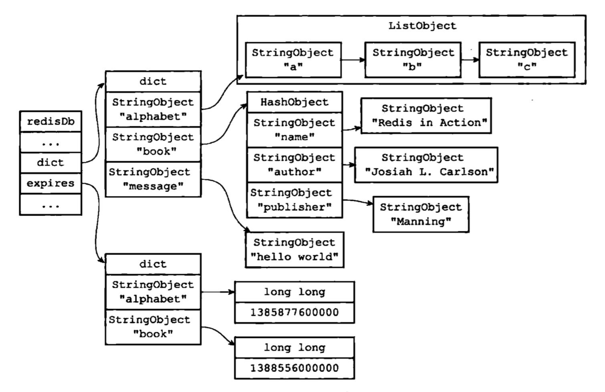

# 缓存淘汰策略

Redis的缓存淘汰策略可以分为两种，一种是开发者在代码中指定的键的过期时间，另一种是当内存不足时Redis会按照预先配置的策略对数据进行淘汰。

## 键的过期时间

开发者可以通过`EXPIRE`、`EXPIREAT`、`PEXPIRE`、`PEXPIREAT`四个命令设置键的过期时间。Redis在内部会使用一个单独的哈希表记录键和其对应的过期时间。

Redis删除过期键的策略结合了惰性删除和定期删除两种。

- 惰性删除

当对键进行读取命令时，Redis会判断该键是否过期，如果过期那么就删除，然后继续执行命令。缺点是，如果一个键一直没有被访问，那么就永远停留在内存里，造成资源浪费，因此Redis还采用了定期删除的策略。

- 定期删除

当定期删除被触发时，Redis会遍历各个数据库，然后随机检查一部分键的过期时间，如果过期了那么就删除过期的键。这里用随机抽取的原因是：如果设置过期时间的键太多，对它们进行全量遍历会影响性能。

## 内存淘汰策略

通过修改配置文件中的`maxmemory-policy`属性可以设置不同的内存淘汰策略。

- noeviction：当内存不足以容纳新的数据时，写入新的数据会报错。
- allkeys-lru：当内存不足时移除最近最少使用的键，也就是LRU cache。
- allkeys-random：当内存不足时随机移除某个键。
- volatile-lru：当内存不足时从设置了过期时间的键中移除最近最少使用的键。
- volatile-random：当内存不足时从设置了过期时间的键中随机移除某个键。
- volatile-ttl：当内存不足时从设置了过期时间的键中移除最早过期的键。
