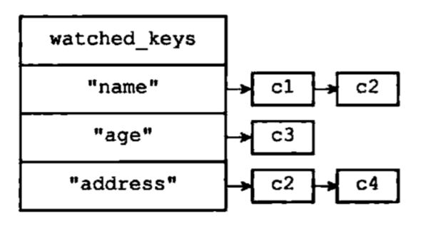

# 事务

Redis的事务主要有三个步骤：

1. 事务开始

`MULTI`命令标志事务的开始，服务器会打开客户端状态的事务标识，表示客户端已进入事务模式。

2. 命令入队

当服务器接收到处于事务模式的客户端发来的消息后，除非是`EXEC`、`DISCARD`、`WATCH`、`MULTI`中的一个命令，否则就把命令放入队列，并且向客户端回复`QUEUED`消息。

3. 事务执行

服务器依次执行队列中的消息，清空客户端的事务状态，并把执行命令的全部结果返回给客户端。

Redis的事务具有原子性。事务中的命令要么全部执行，要么一个都不执行（比如监控的键被修改），但是Redis的事务即使全部执行不代表所有的命令都正确执行，比如某条命令参数错误导致执行失败，Redis仍然会执行完接下来的命令，对已经执行的命令不会有任何影响。

> 作者认为事务中出现错误通常是编程错误，比如少写了一个参数。

## WATCH

服务器会把当前所有正在被监控的键以及客户端之间的关系存在`watched_keys`字段中。

当执行对数据库的修改后（如`SET`、`LPUSH`等命令），会遍历`watched_keys`字段，如果被修改的键存在字典中，那么就打开该键关联的所有客户端的`REDIS_DIRTY_CAS`标识，当服务器执行`EXEC`时，它会先检查客户端的`REDIS_DIRTY_CAS`标识是否打开，如果已经打开，那么就拒绝执行事务。

## Pipeline

管道和事务的区别是：客户端在管道中执行的命令是缓存在客户端的，在提交时打包发送给服务器，好处是可以把多次请求合并成一个，减少请求在网络上的往返时间，比如原本4个请求需要4次往返，合并后只要1次，此外管道不保证多条命令的原子性；而客户端在事务中执行的命令是缓存在服务端的，在提交后服务器从缓存中原子性的执行所有消息。

此外，事务还可以结合`WATCH`实现CAS功能，而管道没有此功能。
